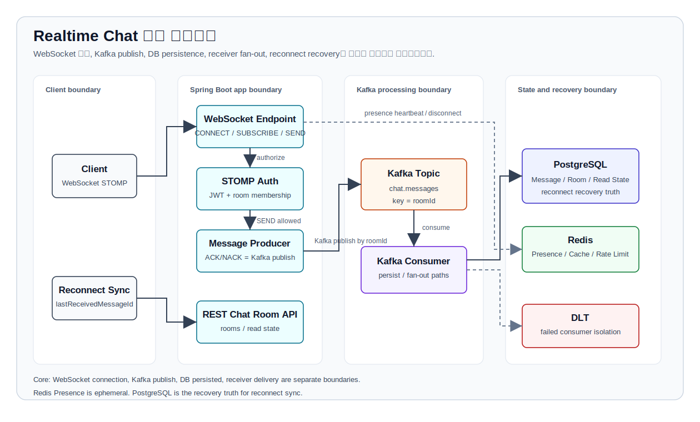

# Realtime Chat

Kafka와 Redis Pub/Sub 기반의 다중 인스턴스 실시간 채팅 시스템에서
**구독 권한, Kafka publish ACK/NACK, room 단위 메시지 순서, 읽음 정합성,
DLT 격리와 수동 replay utility**를 검증한 Spring Boot 백엔드 프로젝트입니다.

이 프로젝트는 단순히 WebSocket 채팅 기능을 구현하는 것이 아니라,
실시간 메시징 시스템에서 쉽게 깨지는 **권한, 순서, 중복, 장애 복구,
presence, cache invalidation** 문제를 코드와 테스트로 검증하는 데 초점을 둡니다.


---

## 30초 요약

이 프로젝트는 Java/Spring 기반 실시간 채팅 백엔드에서 **권한, 메시지 상태 경계,
재연결 보정, room 단위 ordering, 장애 격리**를 코드와 테스트로 검증한 사례입니다.

- 만든 것: Spring Boot + Kafka + Redis Pub/Sub + PostgreSQL 기반 채팅 백엔드
- 설계 포인트: `CONNECT` 인증과 `SUBSCRIBE` 인가 분리
- 상태 경계: Kafka publish ACK/NACK와 DB PERSISTED ACK 분리
- 측정 완료: REST 채팅방 조회 API 937 -> 1,598 RPS
- p95 응답 시간: 212.85ms -> 149.22ms
- 로컬 검증: 1,000-user receiver matrix repeat3에서 missing 0 / duplicate 0
- 아직 주장하지 않음: production 1,000-session benchmark와 mixed traffic p95

ACK / PERSISTED / RECEIVED 의미:

- ACK: Kafka broker가 publish 요청을 accepted 했다는 뜻입니다.
- PERSISTED: DB 저장 완료 또는 기존 idempotent row 확인을 뜻합니다.
- RECEIVED: receiver runner가 room topic MESSAGE를 관측한 기록이며 production delivery claim이 아닙니다.

---

## 전체 아키텍처



Client는 WebSocket STOMP 연결로 메시지를 보내고, Spring Boot app은 인증/인가 후 Kafka에 `roomId` key로 publish합니다.
Kafka consumer는 DB 저장 경로와 receiver fan-out 경로를 분리합니다.
Redis Presence는 TTL 기반 임시 상태이며, PostgreSQL의 message / room / read state가 재연결 복구의 진실 소스입니다.

### 핵심 설계 판단

| 판단 | 이유 | 경계 |
|---|---|---|
| WebSocket 연결, Kafka publish, DB persisted, receiver delivery 분리 | ACK/PERSISTED/RECEIVED가 서로 다른 성공 단계를 의미하기 때문 | ACK는 상대방 수신 완료가 아니라 Kafka publish 결과 |
| Kafka topic은 `roomId` key 사용 | 같은 room 메시지를 같은 partition 순서로 처리하기 위함 | 서로 다른 room 간 전역 순서는 보장하지 않음 |
| PostgreSQL을 recovery truth로 사용 | Redis Pub/Sub와 Presence는 복구용 durable store가 아니기 때문 | 재연결 시 `lastReceivedMessageId` 이후를 sync API로 조회 |
| Redis는 Presence / Cache / Rate Limit에 한정 | 빠른 TTL 상태와 user-level 제한에 적합하기 때문 | `mixed traffic cache hit rate는 추가 측정 예정` |
| DLT로 consumer 실패 격리 | 실패 메시지가 정상 흐름을 막지 않도록 분리하기 위함 | replay 운영 절차와 감사 로그는 별도 과제 |

이 다이어그램은 구현된 핵심 흐름과 검증 대상 경계를 설명하기 위한 단순화된 구조도이며, 운영 배포 토폴로지나 production SLO를 주장하지 않습니다.

상세 설명은 [아키텍처 문서](docs/ARCHITECTURE.md)에 분리했습니다.

---

## 핵심 문제

실시간 채팅 백엔드는 WebSocket 연결만으로 완성되지 않습니다.
다중 서버 환경에서는 메시지가 여러 인스턴스, Kafka, Redis Pub/Sub,
DB 저장 경로를 거치기 때문에 아래 문제가 함께 해결되어야 합니다.

| 문제 | 구현한 대응 |
|---|---|
| 유효한 JWT 사용자가 `roomId`만 알고 다른 방을 구독할 수 있는가 | STOMP `SUBSCRIBE /topic/room.{roomId}` 시 room membership 검증 |
| 메시지 전송 요청이 Kafka publish에 성공했는지 클라이언트가 알 수 있는가 | `/user/queue/messages/ack`, `/user/queue/messages/error` ACK/NACK 응답 |
| 다중 app instance에서 같은 사용자가 SEND 제한을 우회할 수 있는가 | Redis fixed-window key로 user-level global SEND rate limit 적용 |
| WebSocket 재연결 중 Redis Pub/Sub fan-out을 놓칠 수 있는가 | `lastReceivedMessageId` 이후 메시지를 조회하는 reconnect sync API 제공 |
| 같은 채팅방 메시지가 순서대로 처리되는가 | Kafka key를 `roomId`로 사용하고, 같은 room 내 partition offset 순서를 검증 |
| consumer 실패 메시지를 격리하고 재처리할 수 있는가 | `chat.messages.dlt` 격리와 `DltReplayService` manual replay utility |
| 읽음 수가 발신자 본인 메시지나 참여 전 메시지까지 포함하지 않는가 | `senderId != userId`, `joinedAt`, `lastReadMessageId` 기준으로 unread count 재계산 |
| 한 사용자가 여러 세션으로 접속했을 때 일부 세션 종료로 offline 처리되는가 | `userId + sessionId` 단위 Redis TTL presence |
| 메시지 저장 시 관계없는 사용자의 채팅방 목록 cache까지 삭제되는가 | 해당 room member의 `rooms::{userId}` cache만 evict |

---

## Evidence Matrix

### 측정 완료

| 항목 | 결과 | 조건 |
|---|---|---|
| 채팅방 조회 API 최적화 | 937 -> 1,598 RPS | k6 200 VU / 50s / local Docker 기준 |
| p95 응답 시간 | 212.85ms -> 149.22ms | `GET /api/rooms` 중심 REST 조회 테스트 |
| N+1 제거 | 방 N개 기준 2N+1회 쿼리 -> 1회 쿼리 | JPQL Projection |

### 로컬 시나리오 검증

아래 항목은 테스트 또는 local Docker Compose 반복 실행으로 검증한 범위입니다. 운영 성능 claim으로 확장하지 않습니다.

| 항목 | 결과 / 상태 | 조건 |
|---|---|---|
| WebSocket 연결 smoke | 2대 합산 1,158 sessions, 연결 체크 성공률 100% | 연결 안정성만 확인, send-to-receive latency 측정 아님 |
| SUBSCRIBE 권한 검증 | 비멤버 room topic 구독 거부 | Unit + STOMP integration 테스트 |
| Redis global SEND rate limit | user-level fixed-window 제한, Redis 장애 시 fail-closed | Unit 테스트 |
| Kafka publish ACK/NACK | user destination으로 ACK/NACK 전달 | Kafka publish accepted/failed 기준 |
| DB persisted ACK | DB 저장 완료 후 `/user/queue/messages/persisted` 전달 | Unit + STOMP integration 테스트 |
| Receiver matrix low-rate 검산 | accepted/status 분모와 expected/actual delivery matrix 계산 경로 확인 | raw snapshot은 `docs/evidence`, 반복 benchmark 아님 |
| Receiver matrix by-room guard | `summary.byRoom`으로 room별 denominator와 cross-room unexpected delivery 검산 | deterministic fixture, multi-room benchmark 아님 |
| Reconnect message sync | `afterMessageId` 이후 누락 메시지 REST 동기화 | Integration 테스트 |
| client retry idempotency | `(senderId, clientMessageId)` 기준 중복 DB 저장 방지 | Unit + integration 테스트 |
| DLT manual replay | replay 후 `messageKey` 기준 중복 저장 방지 | Testcontainers 기반 통합 테스트 |
| room 단위 ordering | 동일 room 메시지의 partition / offset 순서 검증 | 전역 순서 보장 아님 |
| read receipt 정합성 | sender 제외, joinedAt 이전 메시지 제외 | Service / integration 테스트 |
| multi-session presence | 마지막 session 종료 시에만 offline | Redis session key / set |
| selective cache eviction | room member의 `rooms::{userId}`만 evict | 관계없는 사용자 cache 유지 |
| mixed chat local smoke | ACK 100%, NACK 0%, mixed error 0% | `SMOKE=1`, 1 VU, benchmark 아님 |

Receiver matrix와 mixed probe는 별도 로컬 evidence로 분리합니다.

- Delivery validator manifest smoke:
  2-user local artifact의 manifest/raw JSONL/summary/byRoom 검산 통과
- Receiver matrix 50-user repeat3:
  expected 4,900 / unique 4,900 / missing 0 / duplicate 0, p95 23-38ms
- Receiver matrix 500-user repeat3:
  expected 49,900 / unique 49,900 / missing 0 / duplicate 0, p95 37-47ms
- Receiver matrix 1,000-user repeat3:
  expected 99,900 / unique 99,900 / missing 0 / duplicate 0, p95 45-50ms
- Room-global ordering:
  persisted message id ordering out-of-order 0
- Mixed HTTP probe 10-room/50-user repeat3:
  expected 4,900 / unique 4,900 / missing 0 / duplicate 0, receiver p95 18-20ms
- Mixed HTTP probe HTTP failures:
  HTTP failed 0/90
- 범위:
  local Docker Compose 또는 local 단일 앱 반복 실행이며 production claim이 아닙니다.

### 아직 주장하지 않는 것

| 항목 | 상태 |
|---|---|
| 1,000 session send-to-receive latency | benchmark 미측정 |
| 1,000 session delivery completeness | benchmark 미측정 |
| mixed traffic p95 latency | benchmark 미측정 |

mixed traffic cache hit rate는 추가 측정 예정입니다.
위 항목은 production / multi-instance benchmark로 주장하지 않습니다.
local receiver matrix repeat3와 mixed HTTP probe는 시나리오 검증이며,
production/mixed benchmark로 확장하지 않습니다.
상세 기준은 [WebSocket measurement 문서](docs/WEBSOCKET_MEASUREMENT.md)에 분리했습니다.

---

## 주요 설계 결정

### 1. STOMP `CONNECT` 인증과 `SUBSCRIBE` 인가를 분리

`CONNECT`에서 JWT를 검증하는 것만으로는 충분하지 않습니다. 인증된 사용자가 `roomId`를 추측해 `/topic/room.{roomId}`를 구독할 수 있기 때문입니다.

그래서 inbound channel에 두 단계 검증을 둡니다.

| 단계 | 담당 | 목적 |
|---|---|---|
| `CONNECT` | `WebSocketAuthInterceptor` | JWT 검증, STOMP Principal에 `userId` 바인딩 |
| `SUBSCRIBE` | `WebSocketAuthorizationInterceptor` | `/topic/room.{roomId}` 구독 시 room member 검증 |
| `SEND` | `ChatMessageController` | 메시지 전송 시 room member 재검증 |

비멤버 구독과 malformed room topic은 거부하고, `/topic/presence`처럼 room topic이 아닌 destination은 기존 정책을 유지합니다.

---

### 2. Redis 기반 global SEND rate limit

`RateLimitInterceptor`는 STOMP `SEND` frame에만 user-level rate limit을 적용합니다. 기존 instance-local memory counter 대신 Redis key를 사용해 여러 app instance에 걸친 전역 제한으로 동작합니다.

```text
rate:ws:send:user:{userId}:{epochSecond}
```

| 항목 | 정책 |
|---|---|
| 대상 | STOMP `SEND` frame |
| 기본 제한 | `chat.rate-limit.messages-per-second: 10` |
| Redis key TTL | 2초 |
| Redis 장애 | fail-closed, SEND 거부 |
| 제외 | `CONNECT`, `SUBSCRIBE` |

fixed-window 방식이므로 초 경계에서 순간 burst가 생길 수 있습니다. 더 엄밀한 smoothing이 필요하면 token bucket 또는 sliding window Lua script가 별도 개선 과제입니다.

---

### 3. Kafka publish ACK/NACK와 DB persisted ACK

`/app/chat.send`는 메시지를 직접 DB에 저장하지 않고 Kafka `chat.messages` topic에 publish합니다.

```text
Client SEND /app/chat.send
  -> room member check
  -> KafkaTemplate.send(chat.messages, key = roomId, event)
  -> success callback: /user/queue/messages/ack
  -> failure callback: /user/queue/messages/error
  -> persistence consumer save success: /user/queue/messages/persisted
```

ACK payload 예시:

```json
{
  "clientMessageId": "9b75d8e9-5f73-4f6d-8f1a-3b1c0d7e8d10",
  "roomId": 1,
  "status": "ACCEPTED",
  "acceptedAt": "2026-05-11T10:15:30"
}
```

NACK payload 예시:

```json
{
  "clientMessageId": "9b75d8e9-5f73-4f6d-8f1a-3b1c0d7e8d10",
  "roomId": 1,
  "status": "FAILED",
  "reason": "Kafka publish failed"
}
```

PERSISTED payload 예시:

```json
{
  "clientMessageId": "9b75d8e9-5f73-4f6d-8f1a-3b1c0d7e8d10",
  "messageKey": "3f430c7b-4ed9-4c52-8ef3-9503d19a65f1",
  "messageId": 100,
  "roomId": 1,
  "status": "PERSISTED",
  "persistedAt": "2026-05-11T10:15:31"
}
```

> ACCEPTED ACK는 Kafka broker가 publish 요청을 accepted 했다는 뜻입니다. PERSISTED ACK는 DB 저장 완료 또는 기존 idempotent row 확인을 뜻합니다. 둘 다 Redis Pub/Sub broadcast 완료, 상대 클라이언트 수신 완료, 읽음 완료를 의미하지 않습니다.

`clientMessageId`는 ACK/NACK correlation과 클라이언트 재시도 멱등성에 사용합니다. DB는 `(senderId, clientMessageId)` unique constraint로 같은 발신자의 같은 클라이언트 메시지가 중복 저장되지 않게 막습니다. `messageKey`는 Kafka event/message identity이며 DLT replay와 Kafka-level duplication에 대한 멱등성 기준으로 유지합니다.

---

### 4. room 단위 Kafka ordering

Kafka의 전역 순서를 보장하지 않습니다. 이 프로젝트에서 검증한 순서 범위는 **동일 room 내 partition ordering**입니다.

```text
producer key = roomId
  -> 같은 roomId는 같은 Kafka partition
  -> 같은 partition 안에서는 offset 순서 보장
  -> consumer 저장 시 kafkaPartition, kafkaOffset 기록
  -> DB 조회 시 offset 순서 검증
```

| 보장 범위 | 설명 |
|---|---|
| 같은 room 안의 메시지 순서 | `roomId` key 기반 partition ordering |
| 서로 다른 room 간 순서 | 보장하지 않음 |
| 모든 클라이언트 수신 완료 | receiver matrix local repeat3에서 시나리오 검증, production 보장 아님 |
| send-to-receive p95 latency | receiver matrix와 10-room mixed HTTP probe local repeat3는 시나리오 검증이며, production p95는 추가 측정 예정 |

---

### 5. DLT 격리와 manual replay utility

Kafka consumer 실패 메시지는 DLT로 격리합니다. `DltReplayService`는 `chat.messages.dlt`에 쌓인 `ChatMessageEvent`를 원래 topic인 `chat.messages`로 다시 발행하는 내부 utility입니다.

```text
consumer failure
  -> retry
  -> chat.messages.dlt
  -> 원인 제거
  -> DltReplayService manual replay
  -> chat.messages
  -> consumer 재처리
```

Replay 중복 저장은 `messageKey` unique constraint와 consumer의 `existsByMessageKey` 체크로 방지합니다. 클라이언트 재시도 중복 저장은 별도로 `(senderId, clientMessageId)` unique constraint로 방지합니다.

> 이 기능은 자동 복구 시스템이 아닙니다. 운영 환경에서는 replay 권한 제어, 감사 로그, replay 대상 필터링, 재처리 결과 추적이 추가로 필요합니다.

---

### 6. read receipt 정합성

읽음 처리는 단순히 `lastReadMessageId` 이후 메시지를 세지 않습니다. 아래 조건을 함께 적용합니다.

```text
roomId가 동일해야 함
message.id > lastReadMessageId
message.senderId != userId
message.createdAt >= member.joinedAt
```

또한 `lastReadMessageId`가 해당 room의 메시지인지 확인하고, 사용자가 방에 참여하기 전에 생성된 메시지는 읽음 기준으로 사용할 수 없도록 검증합니다.

중복 read receipt가 들어와도 기존 `lastReadMessageId`보다 크지 않으면 상태를 되돌리지 않습니다.

---

### 7. session 단위 presence

Presence는 user 단일 key가 아니라 session 단위로 관리합니다.

```text
user:presence:{userId}:session:{sessionId}  TTL 60s
user:presence:{userId}:sessions            Redis Set
```

동작 방식:

| 이벤트 | 처리 |
|---|---|
| WebSocket connect | session key 생성, session set에 추가 |
| heartbeat | session key TTL 갱신 |
| disconnect | 해당 session 제거 |
| 마지막 session disconnect | offline event 발행 |
| 일부 session만 disconnect | online 유지 |

클라이언트는 `/app/presence.heartbeat`를 TTL보다 짧은 주기로 보내야 합니다.

---

### 8. Cache Aside selective eviction

채팅방 목록은 사용자별로 cache합니다.

```java
@Cacheable(value = "rooms", key = "#userId")
```

메시지가 저장되면 전체 `rooms` cache를 clear하지 않고, 해당 room 멤버의 cache만 evict합니다.

| 이벤트 | cache 무효화 범위 |
|---|---|
| 메시지 저장 | 해당 room 멤버의 `rooms::{userId}` |
| 읽음 처리 | 읽음 처리한 user의 `rooms::{userId}` |
| 방 생성 / 참여 | 현재 구현은 기존 정책 유지 |

---

## 성능 결과 요약

상세 내용은 [`docs/PERF_RESULT.md`](docs/PERF_RESULT.md)에 정리되어 있습니다.

### REST 조회 API 최적화

이 수치는 채팅방 조회 API 중심의 REST 부하 테스트 결과입니다. 메시지 전송이 포함된 mixed traffic 결과가 아닙니다.

| 메트릭 | Before | After | 개선 |
|---|---:|---:|---:|
| RPS | 937 | 1,598 | +70.5% |
| p50 | 54.27ms | 16.56ms | -69.5% |
| p90 | 172.33ms | 109.37ms | -36.5% |
| p95 | 212.85ms | 149.22ms | -29.9% |
| 총 요청 수 | 67,417 | 118,900 | +76.4% |
| 에러율 | 0% | 0% | - |

테스트 조건:

| 항목 | 값 |
|---|---|
| 시나리오 | 채팅방 목록 / 상세 / 메시지 이력 조회 |
| 부하 | k6 200 VU |
| duration | 50s, warm-up 10s / load 30s / cool-down 10s |
| 데이터 | 200 users, 10 group rooms |
| 환경 | local Docker 기준 |

주요 개선:

| 개선 항목 | Before | After |
|---|---|---|
| N+1 쿼리 | 방 N개 -> 2N+1회 쿼리 | JPQL Projection 단일 쿼리 |
| DB 조회 | 반복 조회마다 DB 접근 | Redis cache hit 시 DB 조회 제거 |
| 주요 조건 쿼리 | 일부 index 활용 부족 | message key, roomId/id, userId 인덱스 사용 확인 |

### WebSocket 부하 테스트

현재 공개된 WebSocket 수치는 연결 안정성과 제한된 send/receive smoke 테스트입니다.

| 항목 | 결과 |
|---|---|
| 단일 인스턴스 동시 session | 579 |
| 2대 스케일아웃 합산 session | 1,158 |
| 연결 체크 성공률 | 100% |
| 단일 인스턴스 STOMP 연결 p95 | 5.52ms |
| 측정 범위 | STOMP 연결, 구독, 제한된 메시지 송수신 smoke |

이 수치는 다음을 의미하지 않습니다.

| 아직 측정하지 않은 것 | 상태 |
|---|---|
| production send-to-receive p95 latency | 50/500/1,000-user local receiver matrix는 시나리오 검증, production benchmark 미측정 |
| production delivery completeness | 50/500/1,000-user local receiver matrix는 시나리오 검증, production benchmark 미측정 |
| room별 수신 순서 정확도 성능 결과 | 추가 측정 예정 |
| production mixed traffic 기준 RPS / p95 | 10-room/50-user local mixed HTTP probe repeat3는 시나리오 검증, production benchmark는 추가 측정 예정 |

### Mixed Chat Scenario

`k6/mixed-chat-test.js`를 추가했습니다.

| 항목 | 상태 |
|---|---|
| 채팅방 목록 조회 | 포함 |
| 메시지 이력 조회 | 포함 |
| WebSocket 연결 | 포함 |
| room topic 구독 | 포함 |
| user ACK/NACK queue 구독 | 포함 |
| 메시지 전송 | 포함 |
| ACK/NACK 수신 | 포함 |
| read receipt API 호출 | 포함 |
| 성능 결과 | local smoke와 10-room/50-user mixed HTTP probe repeat3 시나리오 검증 |

기록하는 지표:

| 지표 | 설명 |
|---|---|
| `http_req_duration` | HTTP 요청 latency |
| `http_req_failed` | HTTP 에러율 |
| `message_send_ack_latency` | STOMP SEND -> Kafka publish ACK 수신까지 |
| `send_to_receive_latency` | 발신자가 자기 메시지를 room topic에서 다시 관측한 경우 |
| `read_receipt_api_latency` | read receipt API 응답 시간 |
| `messages_sent` | 전송한 메시지 수 |
| `acks_received` | ACK 수신 수 |
| `nacks_received` | NACK 수신 수 |
| `messages_received` | WebSocket MESSAGE 수신 수 |
| `ws_connection_success_rate` | WebSocket upgrade 성공률 |
| `ack_success_rate` | 전송 메시지 중 ACK 수신 비율 |
| `nack_rate` | 전송 메시지 중 NACK 수신 비율 |
| `delivery_success_rate` | 발신자 self echo 관측 비율, 전체 receiver delivery completeness 아님 |
| `websocket_connection_failures` | WebSocket 연결 실패 수 |
| `mixed_error_rate` | mixed scenario error rate |

실제 receiver 기준 delivery completeness는 `scripts/ws-delivery-runner.mjs`가 생성한
member / send / receive / status JSONL을 `scripts/delivery-matrix.mjs`로 결합해 계산하도록 분리했습니다.
receiver matrix smoke, 50-user local repeat3, 500-user local repeat3 결과는 [`docs/WEBSOCKET_MEASUREMENT.md`](docs/WEBSOCKET_MEASUREMENT.md)에
남겼지만, 1,000 session과 room-global ordering 검증 전까지 공개 benchmark 지표는 `추가 측정 예정`으로 유지합니다.
mixed chat local smoke 결과는 [`docs/evidence/MIXED_CHAT_SMOKE_2026-05-22.md`](docs/evidence/MIXED_CHAT_SMOKE_2026-05-22.md)에
보존했으며, 이 결과도 benchmark가 아니라 scenario 실행 확인으로만 해석합니다.
새 runner는 ACK/NACK/PERSISTED 상태를
`status.jsonl`에 기록해 accepted / persisted / statusless 분모를 분리합니다.

서버 내부 Micrometer metric은 아래 경계를 관측합니다. 이 값은 end-client 수신 완료율이 아니라
서버 내부 처리 경계입니다.

| metric | 의미 |
| --- | --- |
| `chat.messages.received` | Redis room channel 수신 후 WebSocket room topic으로 브로드캐스트한 메시지 수 |
| `chat.room.fanout.latency` | Redis room channel 수신부터 STOMP room topic 브로드캐스트 호출까지의 서버 내부 처리 시간 |
| `chat.messages.dlt.routed` | Kafka retry 초과 후 DLT recoverer가 라우팅한 메시지 수 |
| `chat.messages.dlt.replayed` | DLT manual replay 재발행 성공 수 |
| `chat.rooms.cache.evictions` | 메시지 저장 후 room member의 rooms cache entry를 evict한 횟수 |

---

## API 요약

### Auth

| Method | Path | 설명 |
|---|---|---|
| `POST` | `/api/auth/signup` | 회원가입 |
| `POST` | `/api/auth/login` | 로그인 |

### Chat Room

| Method | Path | 설명 |
|---|---|---|
| `POST` | `/api/rooms/direct` | 1:1 채팅방 생성 |
| `POST` | `/api/rooms/group` | 그룹 채팅방 생성 |
| `POST` | `/api/rooms/{roomId}/join` | 그룹 채팅방 참여 |
| `GET` | `/api/rooms` | 내 채팅방 목록 |
| `GET` | `/api/rooms/{roomId}` | 채팅방 상세 |
| `GET` | `/api/rooms/{roomId}/messages` | 메시지 이력 |
| `GET` | `/api/rooms/{roomId}/messages/sync` | 재연결 후 누락 메시지 동기화 |
| `POST` | `/api/rooms/{roomId}/read` | 읽음 처리 |

### WebSocket / STOMP

WebSocket endpoint:

```text
/ws
```

| Client action | Destination |
|---|---|
| STOMP 연결 | `CONNECT /ws` |
| 메시지 전송 | `/app/chat.send` |
| 방 메시지 구독 | `/topic/room.{roomId}` |
| Presence heartbeat | `/app/presence.heartbeat` |
| Kafka publish ACK 구독 | `/user/queue/messages/ack` |
| Kafka publish NACK 구독 | `/user/queue/messages/error` |
| DB 저장 완료 ACK 구독 | `/user/queue/messages/persisted` |

메시지 전송 payload 예시:

```json
{
  "clientMessageId": "9b75d8e9-5f73-4f6d-8f1a-3b1c0d7e8d10",
  "roomId": 1,
  "content": "hello",
  "type": "TEXT"
}
```

읽음 처리 payload 예시:

```json
{
  "lastReadMessageId": 100
}
```

---

## 실행 방법

### 1. 전체 Docker Compose 실행

PostgreSQL, Redis, Kafka, Kafka UI, Prometheus, Grafana, app 2대를 함께 실행합니다.

```bash
docker compose up -d
```

서비스 포트:

| 서비스 | URL |
|---|---|
| App #1 | `http://localhost:8081` |
| App #2 | `http://localhost:8082` |
| Kafka UI | `http://localhost:8090` |
| Prometheus | `http://localhost:9090` |
| Grafana | `http://localhost:3000` |

Grafana 기본 계정:

```text
admin / admin
```

### 2. 인프라만 실행하고 애플리케이션 로컬 실행

```bash
docker compose up -d postgres redis kafka kafka-ui

./gradlew bootRun
```

로컬 실행 시 기본 app URL:

```text
http://localhost:8080
```

스키마는 Flyway migration으로 생성됩니다. 기존 `schema.sql` 기반 Docker volume을 쓰던 로컬 환경에서는 migration history가 없을 수 있으므로, 스키마 초기화 문제가 나면 아래처럼 volume을 비운 뒤 다시 실행합니다.

```bash
docker compose down -v
docker compose up -d
```

### 3. 테스트 실행

Testcontainers로 PostgreSQL, Kafka, Redis를 띄우므로 Docker가 실행 중이어야 합니다.

```bash
./gradlew test
./gradlew build
```

### 4. k6 스크립트 문법 검증

```bash
k6 inspect k6/mixed-chat-test.js
```

### 5. 부하 테스트 실행 예시

REST 조회 API 테스트:

```bash
k6 run --env BASE_URL=http://localhost:8081 k6/rest-api-test.js
```

WebSocket smoke 테스트:

```bash
k6 run \
  --env BASE_URL=http://localhost:8081 \
  --env WS_URL=ws://localhost:8081/ws \
  k6/websocket-test.js
```

Mixed chat scenario:

```bash
k6 run \
  --env BASE_URL=http://localhost:8081 \
  --env WS_URL=ws://localhost:8081/ws \
  k6/mixed-chat-test.js
```

Receiver matrix smoke runner:

이 runner는 Node.js 22의 built-in `fetch`와 `WebSocket`을 사용합니다.

```bash
node scripts/ws-delivery-runner.mjs \
  --base http://localhost:8081 \
  --ws ws://localhost:8081/ws,ws://localhost:8082/ws \
  --users 10 \
  --senders 2 \
  --messages 5 \
  --drain-ms 5000 \
  --out-dir artifacts/ws/smoke
```

같은 artifact에 room list, message history, read receipt HTTP probe를 보조 로그로 남기려면 아래 옵션을
추가합니다. `http.jsonl`은 REST 경로 관측용이며 receiver delivery completeness 분모에는 섞지 않습니다.

```bash
node scripts/ws-delivery-runner.mjs \
  --base http://localhost:8081 \
  --ws ws://localhost:8081/ws,ws://localhost:8082/ws \
  --users 10 \
  --senders 2 \
  --messages 5 \
  --mixed-http-probes true \
  --http-probe-users-per-room 1 \
  --drain-ms 5000 \
  --out-dir artifacts/ws/smoke-with-http
```

Multi-room 후보 실행은 room partition을 명시합니다. 이 명령은 도구 준비용이며, artifact 검토 전에는
공개 benchmark로 올리지 않습니다.

```bash
node scripts/ws-delivery-runner.mjs \
  --base http://localhost:8081 \
  --ws ws://localhost:8081/ws,ws://localhost:8082/ws \
  --rooms 2 \
  --users-per-room 3 \
  --senders-per-room 1 \
  --messages 2 \
  --drain-ms 5000 \
  --out-dir artifacts/ws/multi-room-smoke
```

기존 user token과 room을 사용하려면:

```bash
k6 run \
  --env BASE_URL=http://localhost:8081 \
  --env WS_URL=ws://localhost:8081/ws \
  --env AUTH_TOKEN={jwt} \
  --env ROOM_ID=1 \
  k6/mixed-chat-test.js
```

---

## 기술 스택

| 영역 | 기술 |
|---|---|
| Language | Java 21 |
| Framework | Spring Boot 3.4.3 |
| Web | Spring Web, Spring Security |
| Realtime | Spring WebSocket, STOMP |
| Messaging | Apache Kafka 3.9.0 |
| Cache / PubSub / Presence / Rate limit | Redis 7 |
| Database | PostgreSQL 16 |
| Persistence | Spring Data JPA, Hibernate, Flyway |
| Observability | Spring Actuator, Micrometer, Prometheus, Grafana |
| Test | JUnit 5, Mockito, Testcontainers, Awaitility |
| Performance | k6 |
| Infra | Docker Compose |
| Build | Gradle Kotlin DSL |

---

## 테스트 범위

| 테스트 | 검증 내용 |
|---|---|
| `WebSocketAuthorizationInterceptorTest` | room topic SUBSCRIBE 권한 검증 |
| `WebSocketSubscribeAuthorizationIntegrationTest` | 실제 STOMP client 기반 비멤버 구독 거부 |
| `WebSocketAckIntegrationTest` | WebSocket ACK 수신 흐름 |
| `WebSocketPersistedAckIntegrationTest` | DB 저장 완료 PERSISTED ACK 수신 흐름 |
| `MessageOrderingIntegrationTest` | 같은 room 내 Kafka partition / offset 순서 |
| `DltReplayIntegrationTest` | DLT 격리, manual replay, 중복 replay 멱등성 |
| `ReadReceiptServiceTest` | read receipt 정합성 |
| `PresenceServiceTest` | multi-session presence |
| `MessagePersistenceConsumerCacheTest` | room member selective cache eviction |
| `ConsumerRecoveryIntegrationTest` | Kafka consumer 중복 처리 / 복구 흐름 |

---

## 한계

| 항목 | 현재 한계 |
|---|---|
| ACK/NACK | ACCEPTED는 Kafka publish 단계의 결과만 의미합니다. PERSISTED는 DB 저장 완료 또는 기존 idempotent row 확인만 의미합니다. WebSocket broadcast 완료, 상대방 수신 완료, 읽음 완료를 보장하지 않습니다. |
| `clientMessageId` | ACK/NACK correlation과 클라이언트 재시도 멱등성 용도입니다. `(senderId, clientMessageId)` unique constraint가 같은 발신자의 같은 클라이언트 메시지 중복 저장을 막습니다. |
| Rate limit | Redis fixed-window 기반 user-level SEND 제한입니다. 초 경계 burst는 token bucket/sliding window보다 덜 엄밀합니다. 자세한 한계는 [`docs/REDIS_LIMITATIONS.md`](docs/REDIS_LIMITATIONS.md)에 정리했습니다. |
| Kafka ordering | 같은 `roomId`가 같은 partition에 들어가는 범위에 한정됩니다. 서로 다른 room 간 전역 순서는 보장하지 않습니다. |
| DLT replay | 내부 manual utility입니다. 운영 환경에서는 접근 제어, 감사 로그, replay 대상 필터링, 결과 추적이 필요합니다. |
| Redis Pub/Sub fan-out | Pub/Sub는 best-effort입니다. 재연결한 클라이언트는 `lastReceivedMessageId`로 sync API를 호출해 누락 가능성을 보정해야 합니다. |
| Redis Pub/Sub broadcast 실패 | 실패 재전파와 no-ack 동작은 검증했습니다. broadcast 실패의 DLT 적재 end-to-end 검증은 별도 개선 범위입니다. |
| Presence | heartbeat는 클라이언트가 TTL보다 짧은 주기로 `/app/presence.heartbeat`를 보내야 유지됩니다. TTL 만료 이벤트 기반 운영형 감시는 별도 과제입니다. |
| REST 부하 테스트 | 기존 측정값은 조회 중심입니다. 메시지 전송이 섞인 10-room/50-user local mixed HTTP probe repeat3는 시나리오 검증으로만 기록했습니다. |
| WebSocket 성능 | 현재 공개 수치는 연결 안정성과 제한된 smoke 테스트입니다. delivery completeness나 send-to-receive p95 결과가 아닙니다. |
| Cache | 메시지 저장은 selective eviction이지만, 방 생성/참여는 아직 일부 넓은 무효화 정책이 남아 있습니다. mixed traffic cache hit rate는 추가 측정 예정입니다. |

---

## 문서

| 문서 | 내용 |
|---|---|
| [`docs/DESIGN.md`](docs/DESIGN.md) | 아키텍처, Kafka, WebSocket, DLT, read receipt, presence, cache 설계 |
| [`docs/ARCHITECTURE.md`](docs/ARCHITECTURE.md) | README 전체 아키텍처 다이어그램과 설계 경계 |
| [`docs/PERF_RESULT.md`](docs/PERF_RESULT.md) | REST 조회 API 최적화와 k6 측정 결과 |
| [`docs/TESTING.md`](docs/TESTING.md) | 테스트와 smoke runner가 어떤 claim을 지지하는지 정리 |
| [`docs/RUNBOOK.md`](docs/RUNBOOK.md) | DLT, receiver matrix, presence, cache 관련 대응 절차 초안 |
| [`docs/LIMITATIONS.md`](docs/LIMITATIONS.md) | ACK/PERSISTED, delivery, latency, Redis 한계의 canonical index |
| [`docs/INTERVIEW_GUIDE.md`](docs/INTERVIEW_GUIDE.md) | 면접에서 설명할 핵심 질문과 안전한 답변 |
| [`docs/WEBSOCKET_MEASUREMENT.md`](docs/WEBSOCKET_MEASUREMENT.md) | send-to-receive latency와 delivery completeness 측정 계획 |
| [`docs/REDIS_LIMITATIONS.md`](docs/REDIS_LIMITATIONS.md) | Redis fixed-window rate limit과 cache hit rate 한계 |
| [`docs/STUDY_GUIDE.md`](docs/STUDY_GUIDE.md) | 코드 흐름 학습 가이드 |
| [`docs/architecture.drawio`](docs/architecture.drawio) | 이전 컨테이너 다이어그램 참고 자산 |
| [`docs/assets/architecture/overall-architecture.drawio`](docs/assets/architecture/overall-architecture.drawio) | README 전체 아키텍처 편집 참고 자산 |

`monitoring/`의 Prometheus/Grafana 파일은 local template입니다. `/actuator/prometheus`에서 metric과
quantile panel을 직접 검증한 운영 dashboard 증거로 사용하지 않습니다.
