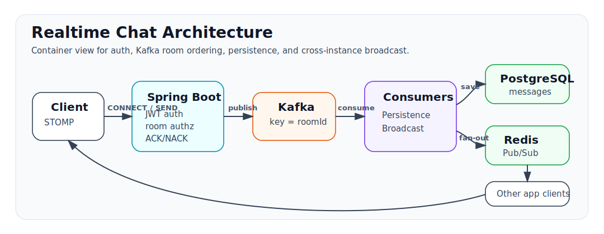

# Realtime Chat

Kafka와 Redis Pub/Sub 기반의 다중 인스턴스 실시간 채팅 시스템에서 메시지 순서, 전달 ACK/NACK, 구독 권한, 읽음 정합성, DLT 복구를 검증한 Spring Boot 백엔드 프로젝트입니다.

## 핵심 문제

실시간 채팅 백엔드는 WebSocket 연결만으로 완성되지 않습니다. 다중 서버 환경에서는 방별 메시지 순서, 서버 간 브로드캐스트, 구독 권한, 장애 복구, 읽음 수 정합성, presence 상태가 함께 맞아야 합니다.

이 프로젝트는 기능 나열보다 백엔드 포트폴리오에서 중요한 운영 문제를 코드와 테스트로 닫는 데 초점을 둡니다.

- 유효한 JWT를 가진 사용자가 `roomId`만 알고 다른 방을 구독할 수 없는가
- 메시지가 Kafka publish 단계에서 accepted 또는 failed 되었는지 클라이언트가 알 수 있는가
- 같은 room의 메시지가 같은 Kafka partition에서 offset 순서대로 처리되는가
- consumer 실패 메시지를 DLT로 격리하고 수동 replay할 수 있는가
- unread count가 발신자 본인 메시지와 참여 전 메시지를 제외하는가
- 한 사용자의 여러 WebSocket session 중 일부만 끊겨도 online 상태가 유지되는가
- 메시지 저장 시 관계없는 사용자의 채팅방 목록 cache까지 지우지 않는가

## 아키텍처 요약

<p align="center">
  
</p>

```text
Client
  -> STOMP CONNECT / SEND / SUBSCRIBE
  -> Spring Boot App
      - CONNECT JWT 인증
      - /topic/room.{roomId} SUBSCRIBE 멤버십 검증
      - /app/chat.send 방 멤버 검증
      - Kafka publish ACK/NACK를 user destination으로 응답
  -> Kafka chat.messages (key = roomId)
      - persistence consumer group -> PostgreSQL 저장
      - broadcast consumer group -> Redis Pub/Sub
  -> App instances
      - Redis Pub/Sub 수신 후 /topic/room.{roomId} 브로드캐스트
```

같은 채팅방의 메시지는 Kafka key를 `roomId`로 사용해 동일 partition 안에서 순서를 유지합니다. 서로 다른 채팅방 사이의 전역 순서는 보장하지 않습니다.

메시지 저장은 `messageKey`와 DB unique constraint로 중복 consume에 대한 멱등성을 확보합니다. DLT replay도 같은 `messageKey` 기준으로 중복 저장을 방지합니다.

## 검증한 항목

| 영역 | 현재 검증 범위 |
| --- | --- |
| STOMP 인증/인가 | `CONNECT` JWT 인증, `/topic/room.{roomId}` 구독 시 room member 검증 |
| 메시지 ACK/NACK | Kafka publish 성공 시 `/user/queue/messages/ack`, 실패 시 `/user/queue/messages/error` 응답 |
| Kafka DLT | consumer 실패 후 `chat.messages.dlt` 격리, `DltReplayService` manual replay, replay 중복 저장 방지 |
| 메시지 순서 | 같은 `roomId`로 발행한 메시지가 같은 partition에 저장되고 offset 순서와 DB 조회 순서가 일치하는지 검증 |
| 읽음 처리 | sender 본인 메시지 제외, `joinedAt` 이전 메시지 제외, 중복 read receipt idempotency |
| Presence | `userId + sessionId` 단위 Redis TTL key와 user session set, 마지막 session 종료 시 offline |
| Cache Aside | 메시지 저장 후 해당 room 멤버의 `rooms::{userId}` cache만 evict |
| Testcontainers | PostgreSQL, Kafka, Redis 기반 통합 테스트 |

## WebSocket 경로

WebSocket endpoint는 `/ws`입니다.

| Client action | Destination |
| --- | --- |
| 메시지 전송 | `/app/chat.send` |
| 방 메시지 구독 | `/topic/room.{roomId}` |
| Presence heartbeat | `/app/presence.heartbeat` |
| Kafka publish ACK 구독 | `/user/queue/messages/ack` |
| Kafka publish NACK 구독 | `/user/queue/messages/error` |

ACK는 Kafka broker가 publish 요청을 accepted 했다는 뜻입니다. PostgreSQL 저장 완료나 상대 클라이언트 수신 완료를 의미하지 않습니다. 저장과 브로드캐스트는 Kafka consumer가 비동기로 처리합니다.

## 성능 결과

상세 내용은 [docs/PERF_RESULT.md](docs/PERF_RESULT.md)에 있습니다.

| 구분 | 측정 범위 | 결과 |
| --- | --- | --- |
| 채팅방 조회 API 최적화 | `GET /api/rooms` 중심 REST 조회 부하 테스트 | RPS 937 -> 1,598, p50 54.27ms -> 16.56ms |
| DB 쿼리 최적화 | N+1 제거, 주요 쿼리 EXPLAIN ANALYZE | 채팅방 목록 단일 쿼리 0.392ms, 주요 쿼리 인덱스 사용 확인 |
| WebSocket 부하 | STOMP 연결 안정성 및 제한된 send/receive smoke 성격 | 2대 합산 동시 WebSocket 1,158 session, 연결 체크 성공률 100% |
| Mixed chat scenario | 조회, 전송, 읽음, WebSocket 수신을 섞은 신규 k6 시나리오 | scenario added, result pending |

현재 공개된 WebSocket 수치는 연결 안정성과 간단한 송수신 흐름 확인 결과입니다. send-to-receive end-to-end latency, 수신 completeness, 메시지 순서 정확도에 대한 성능 수치는 아직 측정 결과로 기록하지 않습니다.

## 테스트 실행 방법

단위/통합 테스트는 Testcontainers로 PostgreSQL, Kafka, Redis를 구동합니다. Docker가 실행 중이어야 합니다.

```bash
./gradlew test
./gradlew build
```

k6 스크립트 문법 검증:

```bash
k6 inspect k6/mixed-chat-test.js
```

부하 테스트 실행 예시:

```bash
docker compose up -d
k6 run --env BASE_URL=http://localhost:8081 k6/rest-api-test.js
k6 run --env BASE_URL=http://localhost:8081 --env WS_URL=ws://localhost:8081/ws k6/websocket-test.js
k6 run --env BASE_URL=http://localhost:8081 --env WS_URL=ws://localhost:8081/ws k6/mixed-chat-test.js
```

## 실행 방법

Docker Compose로 PostgreSQL, Redis, Kafka, Kafka UI, Prometheus, Grafana, 애플리케이션 2대를 실행합니다.

```bash
docker compose up -d
```

애플리케이션만 로컬에서 실행하려면 인프라를 먼저 띄운 뒤 Gradle을 사용합니다.

```bash
docker compose up -d postgres redis kafka kafka-ui
./gradlew bootRun
```

## 기술 스택

| 영역 | 기술 |
| --- | --- |
| Backend | Java 21, Spring Boot 3.4.3, Spring Web, Spring Security |
| Realtime | Spring WebSocket, STOMP |
| Messaging | Apache Kafka 3.9.0 |
| Data | PostgreSQL 16, Redis 7 |
| Observability | Actuator, Micrometer, Prometheus, Grafana |
| Test / Perf | Testcontainers, JUnit 5, k6 |
| Infra | Docker Compose, Gradle Kotlin DSL |

## API 요약

| Method | Path | 설명 |
| --- | --- | --- |
| POST | `/api/auth/signup` | 회원가입 |
| POST | `/api/auth/login` | 로그인 |
| POST | `/api/rooms/direct` | 1:1 채팅방 생성 |
| POST | `/api/rooms/group` | 그룹 채팅방 생성 |
| POST | `/api/rooms/{roomId}/join` | 그룹 채팅방 참여 |
| GET | `/api/rooms` | 내 채팅방 목록 |
| GET | `/api/rooms/{roomId}` | 채팅방 상세 |
| GET | `/api/rooms/{roomId}/messages` | 메시지 이력 |
| POST | `/api/rooms/{roomId}/read` | 읽음 처리 |

## 한계

- ACK/NACK는 Kafka publish 단계의 결과이며 DB 저장 완료, WebSocket 수신 완료, 상대방 단말 표시 완료를 보장하지 않습니다.
- Kafka 순서 보장은 같은 `roomId`가 같은 partition에 들어가는 범위에 한정됩니다. 서로 다른 room 간 전역 순서는 보장하지 않습니다.
- DLT replay는 외부 운영 API가 아니라 내부 manual utility입니다. 운영 환경에서는 접근 제어, 감사 로그, replay 대상 필터링이 추가로 필요합니다.
- Presence heartbeat는 클라이언트가 TTL보다 짧은 주기로 `/app/presence.heartbeat`를 보내야 유지됩니다.
- 기존 REST 부하 테스트는 조회 중심입니다. 신규 mixed k6 시나리오는 추가했지만 아직 성능 결과는 측정하지 않았습니다.

## 문서

- [docs/DESIGN.md](docs/DESIGN.md): 아키텍처, Kafka, WebSocket, DLT, cache, 한계
- [docs/PERF_RESULT.md](docs/PERF_RESULT.md): 채팅방 조회 API 최적화와 k6 측정 결과
- [docs/STUDY_GUIDE.md](docs/STUDY_GUIDE.md): 코드 흐름 학습 가이드
