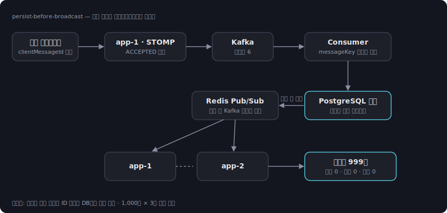

# Realtime Chat


**"화면에 보였다"와 "실제 저장됐다"를 구분하는 채팅.**
DB 커밋 후에만 브로드캐스트하는 persist-before-broadcast 파이프라인을
2대 인스턴스 · 1,000명 수신 검증(유실 0건)으로 확인한 실시간 채팅 백엔드입니다.

`Java 21` `Spring Boot` `WebSocket(STOMP)` `Kafka` `Redis Pub/Sub` `PostgreSQL` `JPA` `Testcontainers` `k6`



## 핵심 결과

### 1. N+1 제거 + 캐시 — RPS +70.5%

- **문제** — 채팅방 목록 API가 방 N개당 2N+1회 쿼리를 실행 (방 50개면 101회).
- **해결** — JPQL 프로젝션으로 단일 쿼리화하고, Redis Cache Aside(TTL 5분)에
  이벤트별 선택 무효화(메시지 수신 → 해당 방 멤버만, 읽음 처리 → 해당 유저만)를 결합.
- **결과** — k6 200 VU에서 RPS 937 → 1,598 (+70.5%), p95 212.85ms → 149.22ms (−29.9%).
  개선 기여의 대부분은 N+1 제거이며 캐시 단독 효과는 분리 측정하지 않음(문서에 명시).
  → [PERF_RESULT §1, §4-2](docs/PERF_RESULT.md)

### 2. 유실되지 않는 메시지 — 수신 검증 99,900/99,900

- **문제** — 브로드캐스트 후 DB 저장이 실패하면, 보였지만 사라지는 메시지가 생긴다.
- **해결** — Kafka 소비 → DB 커밋 → Redis Pub/Sub 순서를 강제(persist-before-broadcast),
  `senderId + clientMessageId` 멱등성, 재연결 시 마지막 메시지 ID 이후 DB 보충 조회.
- **결과** — 2대 인스턴스 · 1방 1,000명 receiver matrix 3회 반복에서
  expected 99,900건 전량 수신 — 유실 0 · 중복 0 · 순서 역전 0.
  → [receiver matrix evidence](docs/evidence/RECEIVER_MATRIX_1000USERS_REPEAT3_2026-05-23.md)

### 3. 인덱스 설계 — EXPLAIN ANALYZE 기반

- **문제** — 데이터가 쌓이면 느려질 조회 경로에서 어떤 인덱스가 실제로 쓰이는지 모른다.
- **해결** — 커서 페이지네이션·멱등성 체크·unread 계산 등 핵심 쿼리 4개를 EXPLAIN ANALYZE로
  분석해 인덱스 5개 설계. 이미 커버되는 인덱스는 의도적으로 추가하지 않음.
- **결과** — 멱등성·멤버 확인은 Index Only Scan, 핵심 쿼리 실행 시간 0.08–1.3ms.
  → [PERF_RESULT §2](docs/PERF_RESULT.md)

### 4. 메시지 상태 의미론 — ACCEPTED ≠ 저장됨

- **문제** — 전송 상태 이름이 실제 보장과 다르면 클라이언트가 잘못된 가정을 하게 된다.
- **해결** — SENDING → ACCEPTED(Kafka 수신) → PERSISTED(DB 커밋) → FAILED 상태를 분리하고
  Redis 발행 실패는 Kafka 재전달로 복구.
- **결과** — 상태별 보장 범위를 명시, 검증 과정에서 Redis PatternTopic 브로드캐스트 버그를
  발견·수정하고 단위 테스트로 고정.

## 실행

```bash
docker compose up -d          # PostgreSQL · Redis · Kafka · app 2대
./gradlew test                # Testcontainers 통합 테스트

# 부하/수신 검증 재현
k6 run k6/mixed-chat-test.js --env SMOKE=1 --env BASE_URL=http://localhost:8081 --env WS_URL=ws://localhost:8081/ws
node scripts/ws-delivery-runner.mjs --base http://localhost:8081 \
  --ws ws://localhost:8081/ws,ws://localhost:8082/ws --users 10 --senders 2 --messages 5
```

## 문서

| 문서 | 내용 |
| --- | --- |
| [PERF_RESULT](docs/PERF_RESULT.md) | N+1·인덱스·캐시·부하 테스트 전 과정과 claim boundary |
| [WEBSOCKET_MEASUREMENT](docs/WEBSOCKET_MEASUREMENT.md) | 수신 검증 방법론 |
| [ARCHITECTURE](docs/ARCHITECTURE.md) | 구조와 설계 결정 |
| [TESTING](docs/TESTING.md) | 테스트 전략 |
| [LIMITATIONS](docs/LIMITATIONS.md) | 한계 |
| [LEGACY_README](docs/LEGACY_README.md) | 이전 상세 README (전체 서사) |

## 주장하지 않는 것

- 모든 수치는 **로컬 Docker** 측정값이며 운영 성능 주장이 아닙니다.
- receiver matrix는 로컬 시나리오 검증이며, 운영 트래픽 기준 send-to-receive latency와
  cache hit ratio는 별도 측정 대상입니다.
- 현재 성능 주장에 포함하지 않는 항목은 [PERF_RESULT §7](docs/PERF_RESULT.md)에 정리했습니다.
