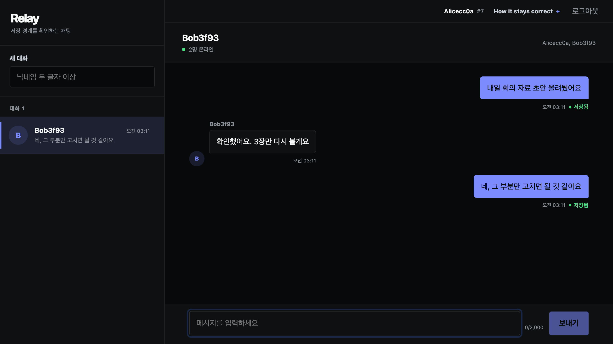
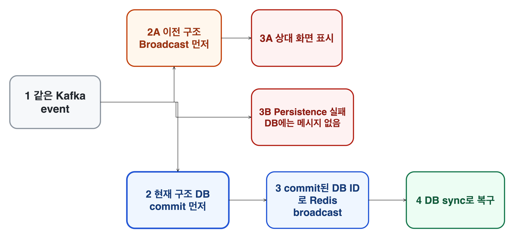

# Realtime Chat

상대 화면에 나타난 메시지가 실제로 저장됐는지 구분하고, 연결이 끊겨도 DB의 마지막 메시지부터 이어지는
Spring Boot + React 채팅 프로젝트입니다.

> 위 이미지는 이 저장소의 <code>web/</code> 클라이언트를 데모 스택에 붙여 두 사용자로 실제 대화를 만든 뒤
> 캡처한 화면입니다. 오른쪽 메시지의 <code>저장됨</code>이 이 프로젝트가 말하려는 것입니다 —
> 화면에 보이는 것과 DB에 저장된 것은 다릅니다.
> 다시 찍으려면 <code>(cd web && node scripts/capture-readme-screen.mjs)</code>.
> 메시지 수신율이나 운영 지연 시간을 꾸며 넣지 않았습니다.

## 이 저장소에서 확인할 것

| 질문 | 구현으로 답한 내용 |
| --- | --- |
| "전송 성공"은 어디까지 성공한 것인가? | <code>SENDING → ACCEPTED → PERSISTED</code>를 분리해 Kafka 접수와 DB 저장을 구분합니다. |
| DB 저장이 실패해도 상대가 메시지를 볼 수 있는가? | DB commit 뒤에만 Redis room fan-out을 실행합니다. |
| 같은 메시지를 재시도하면 두 번 보이는가? | <code>senderId + clientMessageId</code>로 DB와 receiver delivery를 한 건으로 수렴시킵니다. |
| 오프라인 동안 놓친 메시지는 어떻게 찾는가? | 마지막 DB message ID 이후를 sync API로 반복 조회합니다. |
| Redis publish가 실패하면 저장된 메시지는 사라지는가? | Kafka ACK를 보류하고 redelivery에서 기존 DB row로 fan-out만 다시 시도합니다. |

## 프로젝트가 바뀐 과정

| 시기 | 출발점 | 다음 단계로 넘어간 이유 |
| --- | --- | --- |
| 2026년 2월 | WebSocket, Kafka, Redis로 room 단위 순서를 실험 | socket 연결만으로는 저장과 수신의 성공 경계를 설명할 수 없었습니다. |
| 2026년 5월 | idempotency, persisted ACK, reconnect sync 보강 | broadcast가 저장보다 앞설 수 있는 구조를 제거하고 실패 복구를 고정했습니다. |
| 2026년 7월 | React 클라이언트와 두 app E2E 연결 | Alice와 Bob 화면에서 상태 전이·오프라인·재연결을 함께 확인했습니다. |
| 2026년 8월 | 화면을 조밀한 다크 프로툴로 다시 짓고 전달 완전성을 현재 커밋에서 재측정 | 오래 켜 두는 화면이라는 성격에 맞추고, 화면을 바꾼 뒤에도 전달이 그대로인지 확인해야 했습니다. |

## 사용자가 겪는 흐름

1. Alice가 nickname으로 Bob을 찾아 1:1 방을 만듭니다.
2. 메시지를 누르면 화면에 낙관적 row가 생기고 <code>SENDING</code>으로 표시됩니다.
3. Kafka publish가 성공하면 <code>ACCEPTED</code>가 됩니다.
4. PostgreSQL commit이 끝나면 DB message ID를 받은 <code>PERSISTED</code> row로 교체됩니다.
5. Bob은 room topic으로 같은 DB ID의 메시지를 받습니다.
6. 연결이 끊겼다가 돌아오면 마지막 persisted ID 이후를 DB에서 보충합니다.

## 전환점: 저장되지 않은 메시지를 먼저 보여줄 수 있었다

처음에는 persistence consumer와 broadcast consumer가 같은 Kafka event를 따로 처리했습니다.
두 consumer의 완료 순서는 보장되지 않으므로, broadcast가 먼저 끝나면 Bob은 DB에 아직 없는 메시지를 볼 수
있었습니다. 직후 저장이 실패하면 새로고침과 재연결에서 메시지가 사라집니다.

편집 원본: [persist-before-broadcast.drawio](docs/assets/architecture/persist-before-broadcast.drawio)

그림 transcript:

1. 이전 구조와 현재 구조 모두 같은 Kafka event에서 시작합니다.
2. 이전에는 broadcast와 persistence consumer가 독립적으로 실행되어 broadcast가 먼저 끝날 수
   있었습니다.
3. 상대 화면에 표시된 뒤 persistence가 실패하면 DB에는 메시지가 없어 재연결로 복구할 수 없습니다.
4. 현재는 한 consumer가 DB commit을 끝낸 뒤 같은 DB ID로 broadcast하므로 sync API가 메시지를 다시
   찾을 수 있습니다.

이를 다음의 단일 consumer 경로로 바꿨습니다.

| 단계 | 처리 | 사용자에게 보이는 의미 |
| --- | --- | --- |
| 1 | STOMP SEND 검증과 Kafka publish | 아직 저장되지 않음 |
| 2 | Kafka callback 성공 | 발신자에게 <code>ACCEPTED</code> |
| 3 | consumer가 PostgreSQL transaction commit | DB message ID 확정 |
| 4 | commit된 payload를 Redis room channel로 publish | 상대방에게 전달 가능 |
| 5 | 발신자 queue로 persisted notification | <code>PERSISTED</code> |
| 6 | 모든 publish가 성공한 뒤 Kafka ACK | 처리 완료 |

DB 저장이 실패하면 4단계에 도달하지 않으므로 상대 화면에 메시지가 나타나지 않습니다.

근거:

- [DB 실패 전 broadcast 차단 E2E](web/e2e/chat-flow.spec.ts)
- [commit 뒤 publish와 Kafka ACK 순서](src/test/java/com/realtime/chat/MessagePersistenceConsumerPublishTest.java)
- [PERSISTED STOMP 응답 통합 테스트](src/test/java/com/realtime/chat/WebSocketPersistedAckIntegrationTest.java)

## 상태 이름은 수신 확인이 아니다

| 상태 | 확인된 경계 | 확인하지 않은 것 |
| --- | --- | --- |
| <code>SENDING</code> | 클라이언트가 optimistic row 생성 | 서버 접수 |
| <code>ACCEPTED</code> | Kafka publish callback 성공 | DB 저장, 상대 수신 |
| <code>PERSISTED</code> | DB 저장 완료 또는 기존 idempotent row 확인 | 모든 상대의 화면 표시 |
| <code>FAILED</code> | publish 또는 client contract 실패 | 자동 복구 완료 |

읽음 receipt를 구현되지 않은 이중 체크 아이콘으로 꾸미지 않습니다. 상대 수신 완료도 <code>PERSISTED</code>와
같은 의미로 표현하지 않습니다.

## 재시도와 중복 방어

클라이언트는 한 번 만든 <code>clientMessageId</code>를 retry에서도 유지합니다.

- 같은 sender와 clientMessageId의 새 publish는 기존 DB row를 찾습니다.
- 발신자에게 기존 DB ID의 PERSISTED를 다시 알려 optimistic row를 확정합니다.
- receiver room에는 같은 메시지를 다시 broadcast하지 않습니다.
- 클라이언트는 DB message ID로 sync와 live payload의 중복을 제거합니다.

Kafka redelivery는 <code>messageKey</code>로 기존 row를 찾고 unread 증가·cache eviction 같은 부수 효과를
반복하지 않습니다.

근거:

- [같은 clientMessageId의 브라우저 재시도](web/e2e/chat-flow.spec.ts)
- [저장 service idempotency](src/test/java/com/realtime/chat/MessagePersistenceServiceTest.java)
- [같은 room의 Kafka offset 순서](src/test/java/com/realtime/chat/MessageOrderingIntegrationTest.java)

## 오프라인과 재연결

Redis Pub/Sub와 presence는 빠른 임시 상태지만 durable message store가 아닙니다. Bob이 오프라인인 동안
Alice가 보낸 메시지는 PostgreSQL에 저장되고, Bob의 WebSocket이 돌아오면 sync API가 다음을 수행합니다.

1. 클라이언트가 현재 방에서 마지막으로 가진 DB message ID를 보냅니다.
2. 서버가 그 ID 이후 메시지를 오름차순으로 반환합니다.
3. 더 남아 있으면 마지막 응답 ID를 cursor로 반복합니다.
4. live topic과 겹친 메시지는 DB ID로 한 번만 남깁니다.

근거:

- [오프라인 전송과 reconnect sync E2E](web/e2e/chat-flow.spec.ts)
- [sync 순서·인가·cursor 통합 테스트](src/test/java/com/realtime/chat/MessageIntegrationTest.java)

## Redis publish 실패 뒤 복구

DB commit 뒤 Redis room publish가 실패하면 Kafka consumer는 ACK하지 않고 예외를 다시 던집니다.
redelivery에서는 이미 저장된 row를 재사용해 broadcast를 다시 시도합니다.

| 최초 처리 | redelivery |
| --- | --- |
| DB row와 unread 상태 commit | 같은 messageKey의 기존 row 확인 |
| Redis publish 실패 | receiver broadcast만 재시도 |
| Kafka ACK 보류 | publish 성공 뒤 ACK |

이 경로는 deterministic E2E에서 장애를 한 번 주입해, 실패 직후 DB row는 한 건이고 Bob에게는 아직 보이지
않으며, 재전달 뒤에도 DB와 화면이 각각 한 건인지를 확인합니다. 장애 주입 endpoint는 e2e profile에만 있습니다.

## 권한 경계

- STOMP CONNECT에서 JWT를 검증합니다.
- SUBSCRIBE 시 room membership을 확인해 ID를 추측한 비멤버 구독을 막습니다.
- SEND에서도 membership을 다시 확인합니다.
- sync와 message history REST API도 같은 room membership을 요구합니다.
- 사용자 검색 결과에는 nickname만 노출하고 타인의 이메일은 반환하지 않습니다.

## 재현

### 제품 데모

~~~bash
cp .env.example .env
# CHAT_DB_PASSWORD와 JWT_SECRET을 로컬 전용 값으로 교체
docker compose -f docker-compose.demo.yml up --build --wait
~~~

브라우저에서 <http://localhost:14173>을 열고 Alice 데모 계정으로 시작합니다. 공개 demo profile에는
장애 주입과 app instance 진단 endpoint가 등록되지 않습니다.

~~~bash
docker compose -f docker-compose.demo.yml down --volumes
~~~

### 검증

~~~bash
./gradlew test --no-daemon
./gradlew build --no-daemon
cd web
npm ci
npm test
npm run build
~~~

두 app instance와 failure recovery를 포함한 E2E:

~~~bash
docker compose -f docker-compose.demo.yml -f docker-compose.e2e.yml up --build --wait
(cd web && npm run e2e)
docker compose -f docker-compose.demo.yml -f docker-compose.e2e.yml down --volumes
~~~

두 가지를 지켜야 합니다.

- **오버레이를 반드시 겹칩니다.** 공개 데모 게이트웨이는 <code>/ws/app-1</code> 같은 노드 지정 경로를
  일부러 막습니다(노드 정체를 숨기는 것이 공개 데모의 요건이고, 그걸 검증하는 테스트가 따로 있습니다).
  <code>docker-compose.e2e.yml</code> 없이 돌리면 교차 노드 테스트가 WebSocket 연결부터 실패합니다.
- **끝낼 때 <code>--volumes</code>를 붙입니다.** 메시지는 <code>(kafka_partition, kafka_offset)</code>
  유니크 제약으로 중복 저장을 막는데, Kafka 로그만 초기화되고 DB가 남으면 새 메시지의 좌표가 예전 행과
  겹쳐 저장이 영영 재시도에 빠집니다. 볼륨을 함께 지워 두 저장소를 같은 세대로 맞춥니다.

## 저장소 구조

~~~text
src/                      Spring Boot 애플리케이션과 Testcontainers 테스트
web/                      React · Vite · TypeScript 클라이언트와 Playwright E2E
docs/                     설계, 테스트 근거, 한계, runbook
scripts/                  receiver evidence 생성·검산 도구
k6/                       historical local measurement 재현 스크립트
docker-compose.demo.yml   one-click 제품 데모
docker-compose.e2e.yml    두 app instance와 테스트 전용 failure probe
~~~

주요 기술은 Java 21, Spring Boot, PostgreSQL, Kafka, Redis이며, 제품 화면은 React와 TypeScript로
구현했습니다.

## 주장하지 않는 것

- **현재 성능 주장: 없음.**
- 과거 조회·부하 수치를 현재 room-list와 persistence pipeline의 근거로 사용하지 않습니다.
- 한 번의 local E2E를 production delivery completeness나 exactly-once 보장으로 확장하지 않습니다.
- <code>ACCEPTED</code>나 <code>PERSISTED</code>를 상대방 수신 완료로 표현하지 않습니다.
- roomId Kafka key는 같은 room partition 순서를 위한 것이며 전체 방의 전역 순서를 보장하지 않습니다.
- runbook과 DLT replay utility를 production 운영 체계나 SLO로 표현하지 않습니다.

## 더 자세한 문서

- [메시지 생명주기 중심 아키텍처](docs/ARCHITECTURE.md)
- [검증 근거와 실행 명령](docs/TESTING.md)
- [구현 상세](docs/DESIGN.md)
- [로컬 장애 대응 절차](docs/RUNBOOK.md)
- [현재 한계](docs/LIMITATIONS.md)
- [WebSocket 전달 완전성 측정](docs/WEBSOCKET_MEASUREMENT.md) — 50명 receiver matrix 3회 반복, 현재 커밋 고정
- [historical unpinned archive](docs/PERF_RESULT.md)
