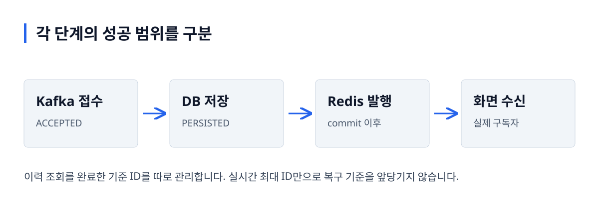

# Realtime Chat

**서버에 저장된 메시지와 상대에게 도착한 메시지를 구분합니다.**

두 사용자의 송수신·중복 요청·재접속 복구를 확인하는 개인 프로젝트입니다. Java 21, Spring Boot, PostgreSQL, Kafka, Redis와 React·TypeScript를 사용합니다. 이번 보강은 저장 표시와 이력 동기화 기준에 집중합니다.

[핵심 판단](#핵심-판단) · [검증 결과](#검증-결과) · [로컬 실행](#로컬-실행) · [코드 읽기](#코드-읽기)

## 실제 화면


실제 로컬 데모에서 두 사용자가 대화한 화면입니다. 발신 메시지의 ‘서버 저장 완료’는 DB 저장을 뜻하며 상대방의 수신·읽음 확인을 뜻하지 않습니다.

## 사용 흐름과 처리 구조

접속 → 대화 상대 선택 → 메시지 전송 → 서버 저장 확인 → 연결 복구 시 이력 보충



그림 설명: Kafka 접수 → DB 저장 → Redis 발행 → 화면 수신. 이력 조회를 완료한 기준 ID를 따로 관리합니다. 실시간 최대 ID만으로 복구 기준을 앞당기지 않습니다.

## 핵심 판단

| 문제 | 선택 | 확인한 근거 |
|---|---|---|
| `PERSISTED`가 상대방 전달 완료처럼 보였습니다. | 문구를 ‘서버 저장 완료’로 바꾸고 접수·저장·수신을 구분합니다. | [DeliveryBadge](web/src/components/DeliveryBadge.tsx) |
| 중간 메시지를 놓치고 더 큰 ID를 받으면 재접속에서 건너뛸 수 있었습니다. | 실시간 최대 ID와 이력 동기화 완료 기준을 분리합니다. | [동기화 회귀](web/src/hooks/use-chat-socket.test.tsx), [실제 WebSocket E2E](web/e2e/chat-flow.spec.ts) |
| DB 저장 후 발행 예외와 구독자의 누락은 다른 실패입니다. | 발행 예외는 기존 재처리 경로, 정상 발행 뒤 누락은 DB 이력 조회로 다룹니다. | [메시지 생명주기](docs/ARCHITECTURE.md), [검증 기록](docs/VERIFICATION.md) |

## 검증 결과

2026-10-02 로컬 검증: 백엔드 **104개**, 프론트 단위 **14개**, 두 서버 E2E **6개**와 일반 데모의 진단 경로 차단 **1개 통과**. 실제 WebSocket의 중간 프레임 하나를 버린 뒤 더 큰 ID를 받고 재접속해 빠진 메시지가 한 번 복구되는지 확인했습니다.

**현재 성능 주장: 없음.** 보존된 50명 수신 실험 3회는 원자료를 다시 검산했으며 새 부하 실험을 실행한 것은 아닙니다. 과거 수치를 현재 room-list와 persistence pipeline의 운영 보장으로 확장하지 않습니다.

[새 검증 기록](docs/VERIFICATION.md) · [수신 실험 기록](docs/WEBSOCKET_MEASUREMENT.md) · [historical unpinned archive](docs/PERF_RESULT.md)

## 로컬 실행

```bash
cp .env.example .env
# CHAT_DB_PASSWORD와 JWT_SECRET을 로컬 전용 값으로 설정
docker compose -p chat-rebuild -f docker-compose.demo.yml up -d --build --wait
```

`http://localhost:14173`에서 두 창을 열고 둘러보기로 들어가 대화합니다. 공개 데모 프로필에는 장애 주입·고정 노드 진단 경로가 없습니다.

```bash
./gradlew test
(cd web && npm ci && npm test && npm run build)
# 테스트 전용 환경에서만 E2E 오버레이를 사용
docker compose -p chat-e2e -f docker-compose.demo.yml -f docker-compose.e2e.yml up -d --build --wait
(cd web && npm run e2e)
```

일반 데모와 E2E는 같은 포트를 쓰므로 함께 띄우지 않습니다. 기존 환경은 `stop`으로 보존합니다. DB와 Kafka 로그는 한 쌍으로 관리하며 한쪽만 초기화하지 않습니다. 화면 재촬영: `(cd web && node scripts/capture-readme-screen.mjs)`.

## 범위와 한계

`ACCEPTED`는 Kafka 접수, `PERSISTED`는 DB 저장입니다. 모든 수신자의 화면 표시나 exactly-once 운영 보장을 뜻하지 않습니다. 처음 들어갈 때 최근 50건을 읽는 범위와 기존 Kafka 구조는 유지했습니다. 다중 지역·모든 장애·임의 쓰기의 ID/commit 역전은 미검증입니다.

이번 개인 보강은 AI 지원으로 구현하고 로컬에서 검증했습니다. 코드로 확인한 동작·실험 관측·미검증 범위를 구분하며, 실제로 겪지 않은 운영 장애나 팀 전체 결과를 개인 성과로 표현하지 않습니다.

## 코드 읽기

[상태 배지](web/src/components/DeliveryBadge.tsx) → [메시지 서비스](src/main/java/com/realtime/chat/service/MessageService.java) → [클라이언트 동기화](web/src/hooks/use-chat-socket.ts) → [회귀 테스트](web/src/hooks/use-chat-socket.test.tsx). [보장 범위·작은 변경 과제](docs/SERVICE_GUIDE.md)에서 누락과 발행 실패를 나눠 읽습니다.

[구현 상세](docs/DESIGN.md) · [실행·장애 재현 안내](docs/RUNBOOK.md) · [기존 저장 후 발행 구조도와 편집 원본](docs/ARCHITECTURE.md)
