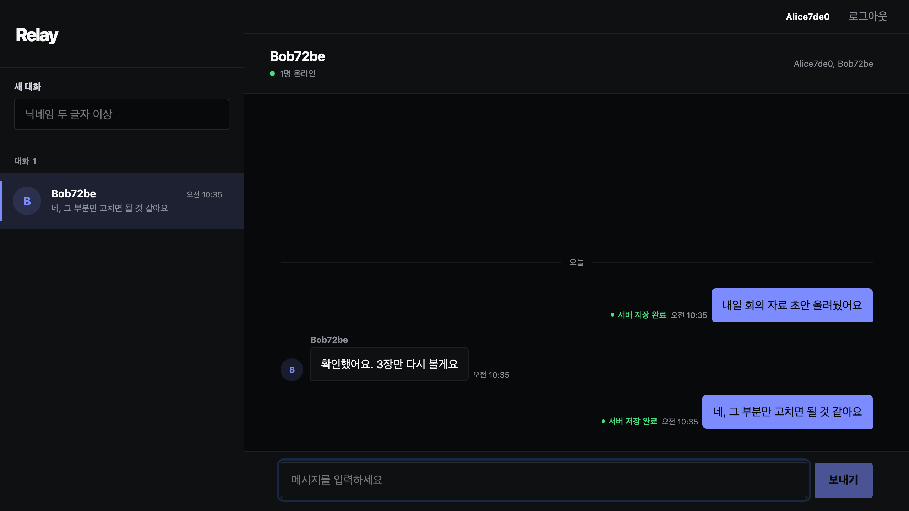

# Realtime Chat

> 방을 만들고, 메시지를 주고받고, 다시 접속해 대화를 이어가는 실시간 채팅 서비스

Realtime Chat은 브라우저에서 대화방을 만들고 참여자끼리 메시지를 나누는 개인 프로젝트입니다. 로그인과 대화방 목록부터 실시간 송수신, 이전 대화 조회까지 하나의 웹 화면에서 체험할 수 있습니다.

## 어떤 서비스를 만들었나요?

채팅을 사용하는 사람은 메시지를 보낸 뒤 어디까지 처리됐는지 알고 싶고, 잠깐 연결이 끊겨도 대화를 이어가고 싶습니다.

이 프로젝트는 메시지 전송 상태를 보여주고, 방에 다시 들어오거나 연결이 복구되면 이전 대화를 불러오는 흐름을 제공합니다. 두 브라우저 창을 열면 서로 다른 사용자의 대화를 직접 확인할 수 있습니다.

## 대화 흐름

로그인 또는 둘러보기 → 대화방 만들기·참여 → 메시지 보내기 → 전송 상태 확인 → 이전 대화 이어보기

## 화면과 주요 기능



실제 로컬 서비스의 두 사용자 화면입니다. 메시지 아래의 **'서버 저장 완료'**는 서버에 기록됐다는 뜻이며, 상대방의 수신이나 읽음 확인을 뜻하지 않습니다.

| 기능 | 사용자가 할 수 있는 일 |
|---|---|
| 계정·둘러보기 | 계정으로 접속하거나 데모 사용자로 서비스를 체험합니다. |
| 대화방 | 대화방을 만들고 목록에서 참여할 방을 선택합니다. |
| 메시지 | 방의 참여자에게 메시지를 보내고 실시간으로 새 대화를 확인합니다. |
| 전송 상태 | 메시지 접수와 서버 저장 상태를 구분해 봅니다. |
| 대화 이력 | 이전 메시지를 조회하고 재접속 뒤 대화를 이어봅니다. |

## 현재 범위

웹 텍스트 채팅과 대화 이력 조회를 제공합니다. 상대방 읽음 확인이나 모든 접속 환경에서의 전달을 보장하는 서비스는 아닙니다. 로컬 데모와 테스트 환경에서 사용하는 개인 프로젝트이며 실제 이용자 규모나 운영 성과를 제시하지 않습니다.

## 로컬에서 실행하기

Docker가 필요합니다.

```bash
cp .env.example .env
# .env의 CHAT_DB_PASSWORD와 JWT_SECRET을 로컬 전용 값으로 설정
docker compose -p chat-rebuild -f docker-compose.demo.yml up -d --build --wait
```

`http://localhost:14173`을 두 창에서 열고 둘러보기로 들어가 대화합니다. 데모 실행에는 PostgreSQL·Kafka·Redis가 함께 포함됩니다.

```bash
# 종료하되 대화 데이터 보존
docker compose -p chat-rebuild -f docker-compose.demo.yml stop
```

일반 데모에는 테스트용 장애 주입 기능이 노출되지 않습니다. 별도 테스트 환경과 상세 실행 명령은 아래 개발 자료를 참고합니다.

## 사용 기술

| 영역 | 기술 |
|---|---|
| 웹 | React · TypeScript · Vite |
| API·실시간 통신 | Java 21 · Spring Boot · WebSocket |
| 데이터·실행 | PostgreSQL · Kafka · Redis · Docker Compose |

## 개발 자료

[서비스와 코드 안내](docs/SERVICE_GUIDE.md) · [실행·문제 확인](docs/RUNBOOK.md) · [검증 기록](docs/VERIFICATION.md) · [처리 구조](docs/ARCHITECTURE.md) · [화면 이미지 출처](docs/assets/README.md)

개인 프로젝트로 AI 지원 구현과 로컬 검증을 진행했습니다. 메시지 처리 방식과 실험의 상세 내용은 개발 문서에 분리해 두었습니다.
