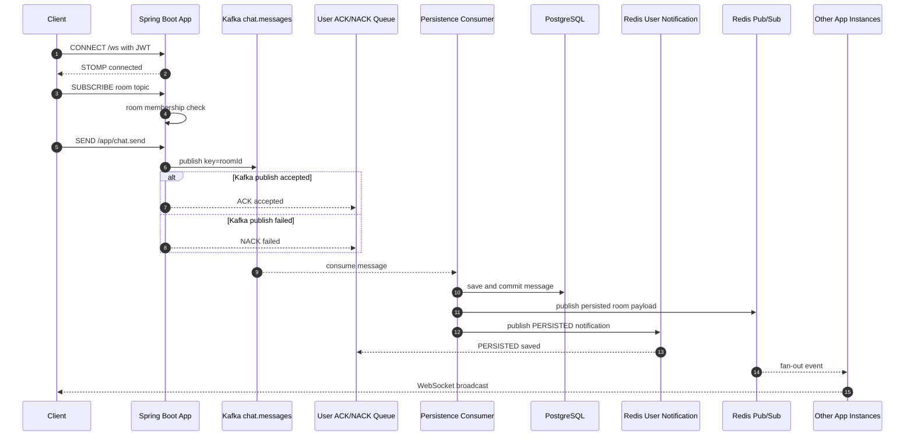
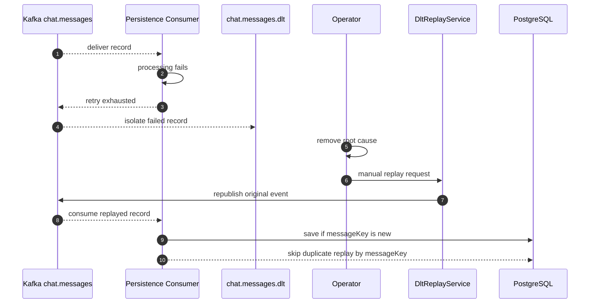

# 실시간 채팅 서비스 설계 문서

## 설계 목표

이 프로젝트는 Kafka와 Redis Pub/Sub 기반의 다중 인스턴스 채팅 백엔드에서 다음 운영 문제를 검증하는 것을 목표로 한다.

- STOMP 연결 인증과 채팅방 구독 인가
- Redis 기반 user-level global WebSocket SEND rate limit
- Redis Pub/Sub best-effort fan-out 보정을 위한 reconnect sync API
- Kafka publish ACK/NACK와 consumer 비동기 처리 분리
- `roomId` key 기반 partition ordering
- `(senderId, clientMessageId)` 기반 클라이언트 재시도 DB 멱등성
- persistence consumer 실패 메시지 DLT 격리와 manual replay utility
- 읽음 처리 정합성
- WebSocket session 단위 presence
- Cache Aside 무효화 범위 최소화

성능 문서에는 실제 측정한 수치만 기록한다. 새 시나리오를 추가했지만 아직 실행하지 않은 경우에는 `추가 측정 예정`으로 표시한다.

## 기술 스택

| 영역 | 기술 | 선택 이유 |
| --- | --- | --- |
| Runtime | Java 21, Spring Boot 3.4.3 | 검증된 JVM 백엔드 생태계 |
| 실시간 | Spring WebSocket, STOMP | destination 기반 구독/발행 모델 |
| 메시징 | Apache Kafka 3.9.0 | partition ordering, consumer group, DLT |
| 서버 간 브로드캐스트 | Redis Pub/Sub | 여러 app instance의 WebSocket session fan-out |
| 캐시/Presence/Rate limit | Redis | TTL key, set, Cache Aside, global fixed-window limit |
| 저장소 | PostgreSQL 16 | 메시지 영속화와 unique constraint 기반 멱등성 |
| Migration | Flyway | versioned SQL migration과 JPA validate 분리 |
| 테스트 | JUnit 5, Testcontainers, k6 | 통합 테스트와 부하 테스트 |

## 아키텍처

```text
Client
  -> STOMP /ws
     - CONNECT Authorization: Bearer {jwt}
     - SUBSCRIBE /topic/room.{roomId}
     - SEND /app/chat.send

Spring Boot App
  -> CONNECT JWT 인증
  -> SUBSCRIBE room member 검증
  -> SEND room member 검증
  -> SEND rate limit 검증
  -> Kafka publish
  -> /user/queue/messages/ack 또는 /user/queue/messages/error 응답

Kafka chat.messages (key = roomId)
  -> persistence consumer group -> PostgreSQL commit
  -> persisted room event + sender notification -> Redis Pub/Sub

Redis Pub/Sub
  -> 각 Spring Boot App instance
  -> /topic/room.{roomId}

Reconnect
  -> GET /api/rooms/{roomId}/messages/sync?afterMessageId={lastReceivedMessageId}
```

메시지 저장과 브로드캐스트는 하나의 순서 경계로 묶는다. persistence transaction이 반환되어 commit된 뒤에만 room event와 sender PERSISTED를 Redis에 발행한다. Redis 발행이 실패하면 Kafka ack를 하지 않아 redelivery되고, 기존 DB row를 다시 조회해 같은 `id/clientMessageId` payload를 멱등 재발행한다.

README는 실제 React 클라이언트 화면과 사용자가 보는 상태 전이를 먼저 보여준다. 모든 기술을 한 장에 넣은
container diagram은 사용하지 않으며, 저장 전후와 재연결 경계는 `ARCHITECTURE.md`의 단계 표와 아래
sequence diagram에서 분리해 설명한다. 전환 전후 비교 그림은
`docs/assets/architecture/persist-before-broadcast.drawio`를 편집 원본으로 관리하고 같은 경로의 2x PNG를
README에 노출한다.

### Message Send Sequence



ACK/NACK는 Kafka publish callback 기준이다. DB commit 뒤 `id/clientMessageId`를 포함한 room payload와 별도 PERSISTED 알림을 발행한다. PERSISTED는 recipient delivery 완료나 read 완료를 의미하지 않는다. `clientMessageId`는 ACK/NACK correlation과 클라이언트 재시도 멱등성에 사용한다.

### Failure / DLT Replay Sequence



DLT replay는 자동 복구가 아니라 원인 제거 후 수동으로 호출하는 내부 utility다. 운영 환경에서는 권한 제어, 감사 로그, replay 대상 필터링, 결과 추적이 추가로 필요하다.

## WebSocket 인증과 인가

### CONNECT 인증

클라이언트는 STOMP `CONNECT` frame의 `Authorization` header에 `Bearer {jwt}`를 담아 보낸다. `WebSocketAuthInterceptor`는 토큰을 검증하고 STOMP session의 `Principal`에 `userId`를 바인딩한다.

### SUBSCRIBE 인가

`WebSocketAuthorizationInterceptor`는 `StompCommand.SUBSCRIBE`만 검사한다.

- destination이 `/topic/room.{roomId}` 또는 `/topic/room.{roomId}.presence` 형식이면 `roomId`를 안전하게 파싱한다.
- 현재 `Principal`의 `userId`가 `chat_room_members(room_id, user_id)`에 존재하는지 확인한다.
- 멤버가 아니거나 `/topic/room.`처럼 room topic 형식이 잘못된 경우 구독을 거부한다.
- 전역 `/topic/presence`는 거부하고 room-scoped presence만 허용한다.

메시지 전송은 `ChatMessageController`에서 다시 한 번 room member 여부를 검증한다. 구독 인가와 전송 인가를 모두 둬서 `roomId` 추측에 의한 도청과 비멤버 전송을 각각 막는다.
client inbound `SEND` destination은 `/app/chat.send`, `/app/presence.heartbeat` 두 개만 허용한다. `/topic`, `/queue`, `/user` broker destination과 임의 `/app` destination으로 직접 SEND하는 우회는 inbound interceptor에서 거부한다.

## WebSocket SEND Rate Limit

`RateLimitInterceptor`는 STOMP `SEND /app/chat.send` frame에만 rate limit을 적용한다. 제한 기준은 userId이며, Redis Lua script의 `INCR + 최초 PEXPIRE`를 한 원자 연산으로 실행한다.

```text
rate:ws:send:user:{userId}:{epochSecond}
```

정책:

- 기본 제한은 `chat.rate-limit.messages-per-second: 10`이다.
- key TTL은 2초로 두어 1초 window가 지나면 자동 정리되도록 한다.
- `CONNECT`, `SUBSCRIBE` 등 non-SEND frame은 rate limit 대상이 아니다.
- Redis Lua 실행이 실패하면 abuse prevention을 우선해 fail-closed로 SEND를 거부한다.
- fixed-window 방식이므로 초 경계 burst가 발생할 수 있다. 더 부드러운 제한은 token bucket 또는 sliding window Lua script가 별도 개선 범위다.

## 메시지 전송 ACK/NACK와 PERSISTED ACK

`/app/chat.send`는 메시지를 직접 DB에 저장하지 않고 Kafka `chat.messages` topic에 publish한다.

```text
Client SEND /app/chat.send
  -> room member check
  -> KafkaTemplate.send(chat.messages, key = roomId, event)
  -> success callback: /user/queue/messages/ack
  -> failure callback: /user/queue/messages/error
  -> persistence consumer save success: /user/queue/messages/persisted
```

ACK payload는 `clientMessageId`, `roomId`, `status=ACCEPTED`, `acceptedAt`을 포함한다. NACK payload는 `clientMessageId`, `roomId`, `status=FAILED`, `reason`을 포함한다.

PERSISTED payload는 `clientMessageId`, `messageKey`, `messageId`, `roomId`, `status=PERSISTED`, `persistedAt`을 포함한다.

ACCEPTED ACK는 Kafka broker가 publish 요청을 accepted 했다는 뜻이다. PERSISTED ACK는 PostgreSQL 저장 완료 또는 기존 idempotent row 확인을 뜻한다. PERSISTED도 Redis Pub/Sub 브로드캐스트 완료, 상대 클라이언트 수신 완료, read 완료를 의미하지 않는다.

`clientMessageId`는 ACK/NACK correlation과 클라이언트 재시도 멱등성 용도다. Kafka event의 `messageKey`는 event/message identity이며 DLT replay와 Kafka-level duplication 멱등성 기준으로 유지한다. DB 저장 시에는 `messages(sender_id, client_message_id)` unique constraint가 같은 발신자의 같은 클라이언트 메시지 중복 저장을 막는다.

## Kafka 토픽과 순서 검증 경계

| Topic | Key | 목적 |
| --- | --- | --- |
| `chat.messages` | `roomId` | 채팅 메시지 저장/브로드캐스트 |
| `chat.read-receipts` | `roomId` | 읽음 처리 |
| `chat.messages.dlt` | 원 record key 또는 `roomId` | 실패 채팅 메시지 격리 |
| `chat.read-receipts.dlt` | 원 record key 또는 `roomId` | 실패 read receipt 격리 |

순서 검증 범위는 다음으로 제한한다. Claim boundary: 동일 room partition 범위로만 해석한다.

- producer는 `roomId`를 Kafka key로 사용한다.
- 같은 `roomId`의 메시지는 같은 partition에 들어간다.
- Kafka는 같은 partition 안에서 offset 순서를 제공하며, 이 프로젝트는 동일 room partition 범위로만 검증한다.
- consumer는 저장 시 `kafkaPartition`, `kafkaOffset`을 함께 기록한다.
- 서로 다른 room 간 전역 순서는 보장하지 않는다.

통합 테스트는 단일 room에 순차 메시지를 발행하고, 저장된 메시지의 partition이 동일하며 offset 오름차순 content가 발행 순서와 일치하는지 확인한다.

## DLT Replay

Kafka consumer는 manual ack와 `DefaultErrorHandler`, `DeadLetterPublishingRecoverer`를 사용한다. persistence consumer 실패는 통합 테스트에서 DLT 격리와 manual replay를 검증한다.

`DltReplayService`는 `chat.messages.dlt`에 격리된 `ChatMessageEvent`를 원래 `chat.messages` topic으로 재발행하는 manual replay utility다. 자동 복구 기능이 아니라 원인 제거 후 수동으로 호출하는 내부 service utility다.

- replay key는 DLT record key가 있으면 그대로 사용하고, 없으면 `event.roomId`를 사용한다.
- replay 시작/성공/실패 로그에는 `messageKey`, DLT topic/partition/offset, target topic, key, target offset을 남긴다.
- 자동 listener나 외부 admin REST API는 제공하지 않는다.
- replay 중복 저장 방지는 `messageKey` unique constraint와 consumer의 `existsByMessageKey` 체크에 의존한다.
- 클라이언트 재시도 중복 저장 방지는 별도 기준인 `(senderId, clientMessageId)` unique constraint에 의존한다.

운영 환경에서는 replay 권한 제어, 감사 로그, replay 대상 필터링, 재처리 결과 추적이 추가로 필요하다.

Redis Pub/Sub publish 실패는 `RedisPubSubService.publishPersistedMessage(MessageResponse)`에서 예외를 재전파해 Kafka ack 전에 consumer 실패로 처리한다. redelivery는 기존 DB row를 다시 읽어 동일 payload를 재발행하며 클라이언트는 DB `id`와 `clientMessageId`로 중복을 제거한다. broadcast 실패 DLT 적재 end-to-end 검증은 별도 개선 범위다.

## 읽음 처리

읽음 처리는 `lastReadMessageId`를 기준으로 member row를 갱신하고 unread count를 재계산한다.

읽음 처리 요청 시 `lastReadMessageId`가 해당 room의 메시지인지 확인하고, 사용자가 참여하기 전에 생성된 메시지는 읽음 기준으로 거부한다.

unread count 계산 기준:

- 같은 room의 메시지
- `message.id > lastReadMessageId`
- `message.senderId != userId`
- `message.createdAt >= member.joinedAt`

중복 read receipt가 들어와도 기존 `lastReadMessageId`보다 크지 않으면 상태를 되돌리지 않는다. Redis는 cache로 사용하며, 장애 시 DB 기준으로 재계산할 수 있는 구조를 유지한다.

## Presence

Presence는 user 단일 key가 아니라 session 단위로 관리한다.

```text
user:presence:{userId}:session:{sessionId}  TTL 60s
user:presence:{userId}:sessions             Redis set
```

- WebSocket connect 시 session key를 만들고 session set에 추가한다.
- disconnect 시 해당 session key를 삭제하고 session set에서 제거한다.
- 같은 user의 다른 session이 남아 있으면 online 상태를 유지한다.
- 마지막 session이 사라질 때만 offline event를 publish한다.
- 클라이언트는 `/app/presence.heartbeat`를 TTL보다 짧은 주기로 보내 session TTL을 갱신한다.

Heartbeat가 오지 않으면 session key가 만료될 수 있다. TTL 만료 이벤트 자체를 offline 전환의 유일한 근거로 삼는 운영형 presence 감시는 별도 개선 과제다.

## Cache Aside

채팅방 목록은 `@Cacheable(value = "rooms", key = "#userId")` 기준으로 사용자별 cache를 사용한다.

무효화 정책:

| 이벤트 | 무효화 범위 |
| --- | --- |
| 방 생성/참여 | 현재 구현은 영향 범위가 넓어 기존 정책 유지 |
| 메시지 저장 | transaction commit 후 해당 room 멤버의 `rooms::{userId}`를 best-effort evict |
| 읽음 처리 | 읽음 처리한 user의 `rooms::{userId}` evict |

메시지 저장 transaction 안에서는 대상 userId만 확보하고 cache 접근은 `afterCommit`에서 수행한다. Redis cache 장애는 로그와 metric 경계로 남기되 이미 commit된 message/unread를 rollback하거나 Kafka redelivery로 바꾸지 않는다. 전체 clear를 하지 않으므로 관계없는 사용자의 cache도 삭제되지 않는다.

## Reconnect Sync API

Redis Pub/Sub는 실시간 fan-out 용도이며, subscriber가 끊겨 있는 동안의 메시지를 보관하지 않는다. 클라이언트는 WebSocket 재연결 후 마지막으로 수신한 메시지 id를 기준으로 REST sync API를 호출해 누락 가능성을 보정한다.

```text
GET /api/rooms/{roomId}/messages/sync?afterMessageId={lastReceivedMessageId}&limit={limit}
```

정책:

- room member만 호출할 수 있다.
- `afterMessageId`가 있으면 해당 메시지가 같은 room의 메시지인지 검증한다.
- 응답은 `id ASC` 순서로 반환해 클라이언트가 순서대로 append할 수 있게 한다.
- `limit` 기본값은 50, 최대값은 100이다.
- `afterMessageId`가 없으면 최신 메시지 묶음을 `id ASC`로 반환한다.

이 API는 WebSocket recipient delivery guarantee가 아니다. Redis Pub/Sub의 best-effort 한계를 클라이언트 재연결 시 REST 조회로 보정하는 경로다.

## 성능과 k6 시나리오

현재 측정 완료된 성능 결과는 [PERF_RESULT.md](PERF_RESULT.md)에 기록한다.

- REST 조회 성능 결과는 채팅방 목록 API 최적화, N+1 제거, Redis cache 효과를 확인한 결과다.
- 기존 WebSocket k6 결과는 연결 안정성과 제한된 send/receive smoke 성격이다.
- send-to-receive end-to-end latency, 수신 completeness, 메시지 순서 정확도는 local 시나리오 검증과 production benchmark를 분리해 기록한다.
- `k6/mixed-chat-test.js`는 조회, WebSocket 전송, ACK/NACK, 읽음 처리를 함께 수행하는 시나리오다. 2026-05-22 local smoke는 통과했다. receiver 기준 수치는 2026-05-23 10-room/50-user mixed HTTP probe repeat3에서 local 시나리오 검증으로 기록했으며, production benchmark는 추가 측정 예정이다.

## 현재 한계

- ACCEPTED ACK/NACK는 Kafka publish 단계까지만 의미한다.
- PERSISTED ACK는 DB 저장 완료 또는 기존 idempotent row 확인까지만 의미하며, delivered/read ACK를 의미하지 않는다.
- `clientMessageId`는 클라이언트 재시도 중복 저장 방지에 사용하지만 delivered ACK를 의미하지 않는다.
- WebSocket SEND rate limit은 Redis fixed-window 방식이라 초 경계 burst를 완전히 smoothing하지 않는다.
- Redis Pub/Sub fan-out은 best-effort이며, 클라이언트는 재연결 시 sync API로 누락 가능성을 보정해야 한다.
- 같은 room 내 순서는 Kafka partition ordering에 의존하며, 전역 순서는 제공하지 않는다.
- `chat.messages.dlt` replay만 manual utility로 제공한다. `chat.read-receipts.dlt` replay 자동화는 별도 과제다.
- Presence heartbeat는 클라이언트 협조가 필요하다.
- DLT replay는 내부 service utility이며 운영용 API, 권한 제어, 감사 로그는 아직 없다.
- k6 mixed scenario는 local smoke로 주요 경로 실행을 확인했고, receiver 기준 10-room/50-user mixed HTTP probe repeat3는 local 시나리오 검증으로 기록했다. Claim boundary: production benchmark와 cache hit ratio는 별도 실행 후 기록해야 한다.
