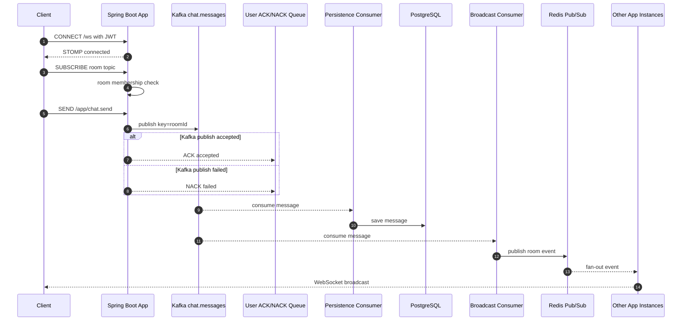
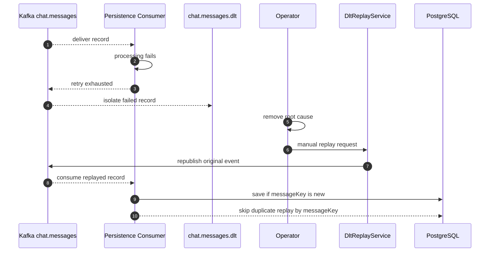

# 실시간 채팅 서비스 설계 문서

## 설계 목표

이 프로젝트는 Kafka와 Redis Pub/Sub 기반의 다중 인스턴스 채팅 백엔드에서 다음 운영 문제를 검증하는 것을 목표로 한다.

- STOMP 연결 인증과 채팅방 구독 인가
- Redis 기반 user-level global WebSocket SEND rate limit
- Kafka publish ACK/NACK와 consumer 비동기 처리 분리
- `roomId` key 기반 partition ordering
- `(senderId, clientMessageId)` 기반 클라이언트 재시도 DB 멱등성
- persistence consumer 실패 메시지 DLT 격리와 manual replay utility
- 읽음 처리 정합성
- WebSocket session 단위 presence
- Cache Aside 무효화 범위 최소화

성능 문서에는 실제 측정한 수치만 기록한다. 새 시나리오를 추가했지만 아직 실행하지 않은 경우에는 `scenario added, result pending`으로 표시한다.

## 기술 스택

| 영역 | 기술 | 선택 이유 |
| --- | --- | --- |
| Runtime | Java 21, Spring Boot 3.4.3 | 검증된 JVM 백엔드 생태계 |
| 실시간 | Spring WebSocket, STOMP | destination 기반 구독/발행 모델 |
| 메시징 | Apache Kafka 3.9.0 | partition ordering, consumer group, DLT |
| 서버 간 브로드캐스트 | Redis Pub/Sub | 여러 app instance의 WebSocket session fan-out |
| 캐시/Presence/Rate limit | Redis | TTL key, set, Cache Aside, global fixed-window limit |
| 저장소 | PostgreSQL 16 | 메시지 영속화와 unique constraint 기반 멱등성 |
| 테스트 | JUnit 5, Testcontainers, k6 | 통합 테스트와 부하 테스트 |

## 아키텍처

```text
Client
  -> STOMP /ws
     - CONNECT Authorization: Bearer {jwt}
     - SUBSCRIBE /topic/room.{roomId}
     - SEND /app/chat.send

Spring Boot App
  -> CONNECT JWT 인증
  -> SUBSCRIBE room member 검증
  -> SEND room member 검증
  -> SEND rate limit 검증
  -> Kafka publish
  -> /user/queue/messages/ack 또는 /user/queue/messages/error 응답

Kafka chat.messages (key = roomId)
  -> persistence consumer group -> PostgreSQL
  -> broadcast consumer group -> Redis Pub/Sub

Redis Pub/Sub
  -> 각 Spring Boot App instance
  -> /topic/room.{roomId}
```

메시지 저장과 브로드캐스트는 Kafka consumer group을 분리한다. 저장 consumer와 broadcast consumer는 같은 Kafka topic을 독립적으로 소비하며, 각 consumer group의 실패/지연은 별도로 관찰한다.

README용 container diagram은 `docs/architecture.drawio`를 원본으로 관리하고, GitHub에서 바로 보이는 export 결과를 `docs/architecture.svg`로 둔다. 상세 흐름은 README가 아니라 아래 sequence diagram에서 분리해 설명한다.

### Message Send Sequence



ACK/NACK는 Kafka publish callback 기준이다. DB 저장 완료, Redis Pub/Sub broadcast 완료, recipient delivery 완료를 의미하지 않는다. `clientMessageId`는 ACK/NACK correlation과 클라이언트 재시도 멱등성에 사용한다.

### Failure / DLT Replay Sequence



DLT replay는 자동 복구가 아니라 원인 제거 후 수동으로 호출하는 내부 utility다. 운영 환경에서는 권한 제어, 감사 로그, replay 대상 필터링, 결과 추적이 추가로 필요하다.

## WebSocket 인증과 인가

### CONNECT 인증

클라이언트는 STOMP `CONNECT` frame의 `Authorization` header에 `Bearer {jwt}`를 담아 보낸다. `WebSocketAuthInterceptor`는 토큰을 검증하고 STOMP session의 `Principal`에 `userId`를 바인딩한다.

### SUBSCRIBE 인가

`WebSocketAuthorizationInterceptor`는 `StompCommand.SUBSCRIBE`만 검사한다.

- destination이 `/topic/room.{roomId}` 형식이면 `roomId`를 안전하게 파싱한다.
- 현재 `Principal`의 `userId`가 `chat_room_members(room_id, user_id)`에 존재하는지 확인한다.
- 멤버가 아니거나 `/topic/room.`처럼 room topic 형식이 잘못된 경우 구독을 거부한다.
- `/topic/presence`처럼 room topic이 아닌 destination은 기존 정책을 유지하기 위해 통과한다.

메시지 전송은 `ChatMessageController`에서 다시 한 번 room member 여부를 검증한다. 구독 인가와 전송 인가를 모두 둬서 `roomId` 추측에 의한 도청과 비멤버 전송을 각각 막는다.

## WebSocket SEND Rate Limit

`RateLimitInterceptor`는 STOMP `SEND` frame에만 rate limit을 적용한다. 제한 기준은 userId이며, Redis fixed-window key를 사용해 여러 app instance에서 같은 카운터를 공유한다.

```text
rate:ws:send:user:{userId}:{epochSecond}
```

정책:

- 기본 제한은 `chat.rate-limit.messages-per-second: 10`이다.
- key TTL은 2초로 두어 1초 window가 지나면 자동 정리되도록 한다.
- `CONNECT`, `SUBSCRIBE` 등 non-SEND frame은 rate limit 대상이 아니다.
- Redis increment 또는 TTL 설정이 실패하면 abuse prevention을 우선해 fail-closed로 SEND를 거부한다.
- fixed-window 방식이므로 초 경계 burst가 발생할 수 있다. 더 부드러운 제한은 token bucket 또는 sliding window Lua script가 별도 개선 범위다.

## 메시지 전송 ACK/NACK

`/app/chat.send`는 메시지를 직접 DB에 저장하지 않고 Kafka `chat.messages` topic에 publish한다.

```text
Client SEND /app/chat.send
  -> room member check
  -> KafkaTemplate.send(chat.messages, key = roomId, event)
  -> success callback: /user/queue/messages/ack
  -> failure callback: /user/queue/messages/error
```

ACK payload는 `clientMessageId`, `roomId`, `status=ACCEPTED`, `acceptedAt`을 포함한다. NACK payload는 `clientMessageId`, `roomId`, `status=FAILED`, `reason`을 포함한다.

ACK는 Kafka broker가 publish 요청을 accepted 했다는 뜻이다. PostgreSQL 저장 완료, Redis Pub/Sub 브로드캐스트 완료, 상대 클라이언트 수신 완료를 의미하지 않는다.

`clientMessageId`는 ACK/NACK correlation과 클라이언트 재시도 멱등성 용도다. Kafka event의 `messageKey`는 event/message identity이며 DLT replay와 Kafka-level duplication 멱등성 기준으로 유지한다. DB 저장 시에는 `messages(sender_id, client_message_id)` unique constraint가 같은 발신자의 같은 클라이언트 메시지 중복 저장을 막는다.

## Kafka 토픽과 순서 보장

| Topic | Key | 목적 |
| --- | --- | --- |
| `chat.messages` | `roomId` | 채팅 메시지 저장/브로드캐스트 |
| `chat.read-receipts` | `roomId` | 읽음 처리 |
| `chat.messages.dlt` | 원 record key 또는 `roomId` | 실패 채팅 메시지 격리 |
| `chat.read-receipts.dlt` | 원 record key 또는 `roomId` | 실패 read receipt 격리 |

순서 보장 범위는 다음으로 제한한다.

- producer는 `roomId`를 Kafka key로 사용한다.
- 같은 `roomId`의 메시지는 같은 partition에 들어간다.
- Kafka는 같은 partition 안에서 offset 순서를 보장한다.
- consumer는 저장 시 `kafkaPartition`, `kafkaOffset`을 함께 기록한다.
- 서로 다른 room 간 전역 순서는 보장하지 않는다.

통합 테스트는 단일 room에 순차 메시지를 발행하고, 저장된 메시지의 partition이 동일하며 offset 오름차순 content가 발행 순서와 일치하는지 확인한다.

## DLT Replay

Kafka consumer는 manual ack와 `DefaultErrorHandler`, `DeadLetterPublishingRecoverer`를 사용한다. persistence consumer 실패는 통합 테스트에서 DLT 격리와 manual replay를 검증한다.

`DltReplayService`는 `chat.messages.dlt`에 격리된 `ChatMessageEvent`를 원래 `chat.messages` topic으로 재발행하는 manual replay utility다. 자동 복구 기능이 아니라 원인 제거 후 수동으로 호출하는 내부 service utility다.

- replay key는 DLT record key가 있으면 그대로 사용하고, 없으면 `event.roomId`를 사용한다.
- replay 시작/성공/실패 로그에는 `messageKey`, DLT topic/partition/offset, target topic, key, target offset을 남긴다.
- 자동 listener나 외부 admin REST API는 제공하지 않는다.
- replay 중복 저장 방지는 `messageKey` unique constraint와 consumer의 `existsByMessageKey` 체크에 의존한다.
- 클라이언트 재시도 중복 저장 방지는 별도 기준인 `(senderId, clientMessageId)` unique constraint에 의존한다.

운영 환경에서는 replay 권한 제어, 감사 로그, replay 대상 필터링, 재처리 결과 추적이 추가로 필요하다.

Redis Pub/Sub broadcast 실패는 `RedisPubSubService.publish(ChatMessageEvent)`에서 예외를 재전파해 Kafka ack 전에 consumer 실패로 처리되도록 한다. 현재 테스트는 publish 실패 재전파와 broadcast consumer의 no-ack 동작을 단위 테스트로 검증하며, broadcast 실패 DLT 적재 end-to-end 검증은 별도 개선 범위다.

## 읽음 처리

읽음 처리는 `lastReadMessageId`를 기준으로 member row를 갱신하고 unread count를 재계산한다.

읽음 처리 요청 시 `lastReadMessageId`가 해당 room의 메시지인지 확인하고, 사용자가 참여하기 전에 생성된 메시지는 읽음 기준으로 거부한다.

unread count 계산 기준:

- 같은 room의 메시지
- `message.id > lastReadMessageId`
- `message.senderId != userId`
- `message.createdAt >= member.joinedAt`

중복 read receipt가 들어와도 기존 `lastReadMessageId`보다 크지 않으면 상태를 되돌리지 않는다. Redis는 cache로 사용하며, 장애 시 DB 기준으로 재계산할 수 있는 구조를 유지한다.

## Presence

Presence는 user 단일 key가 아니라 session 단위로 관리한다.

```text
user:presence:{userId}:session:{sessionId}  TTL 60s
user:presence:{userId}:sessions             Redis set
```

- WebSocket connect 시 session key를 만들고 session set에 추가한다.
- disconnect 시 해당 session key를 삭제하고 session set에서 제거한다.
- 같은 user의 다른 session이 남아 있으면 online 상태를 유지한다.
- 마지막 session이 사라질 때만 offline event를 publish한다.
- 클라이언트는 `/app/presence.heartbeat`를 TTL보다 짧은 주기로 보내 session TTL을 갱신한다.

Heartbeat가 오지 않으면 session key가 만료될 수 있다. TTL 만료 이벤트 자체를 offline 전환의 유일한 근거로 삼는 운영형 presence 감시는 별도 개선 과제다.

## Cache Aside

채팅방 목록은 `@Cacheable(value = "rooms", key = "#userId")` 기준으로 사용자별 cache를 사용한다.

무효화 정책:

| 이벤트 | 무효화 범위 |
| --- | --- |
| 방 생성/참여 | 현재 구현은 영향 범위가 넓어 기존 정책 유지 |
| 메시지 저장 | 해당 room 멤버 userId만 조회해 `rooms::{userId}` evict |
| 읽음 처리 | 읽음 처리한 user의 `rooms::{userId}` evict |

메시지 저장 시 `rooms` cache 전체 clear를 하지 않으므로, 관계없는 사용자의 채팅방 목록 cache가 불필요하게 삭제되지 않는다.

## 성능과 k6 시나리오

현재 측정 완료된 성능 결과는 [PERF_RESULT.md](PERF_RESULT.md)에 기록한다.

- REST 조회 성능 결과는 채팅방 목록 API 최적화, N+1 제거, Redis cache 효과를 확인한 결과다.
- 기존 WebSocket k6 결과는 연결 안정성과 제한된 send/receive smoke 성격이다.
- send-to-receive end-to-end latency, 수신 completeness, 메시지 순서 정확도는 아직 성능 결과로 기록하지 않는다.
- `k6/mixed-chat-test.js`는 조회, WebSocket 전송, ACK/NACK, 읽음 처리를 함께 수행하는 시나리오로 추가한다. 실행 결과는 아직 pending이다.

## 현재 한계

- ACK/NACK는 Kafka publish 단계까지만 의미한다.
- `clientMessageId`는 클라이언트 재시도 중복 저장 방지에 사용하지만 persisted ACK나 delivered ACK를 의미하지 않는다.
- WebSocket SEND rate limit은 Redis fixed-window 방식이라 초 경계 burst를 완전히 smoothing하지 않는다.
- 같은 room 내 순서는 Kafka partition ordering에 의존하며, 전역 순서는 제공하지 않는다.
- `chat.messages.dlt` replay만 manual utility로 제공한다. `chat.read-receipts.dlt` replay 자동화는 별도 과제다.
- Presence heartbeat는 클라이언트 협조가 필요하다.
- DLT replay는 내부 service utility이며 운영용 API, 권한 제어, 감사 로그는 아직 없다.
- k6 mixed scenario는 추가되지만 실제 성능 수치는 별도 실행 후 기록해야 한다.
